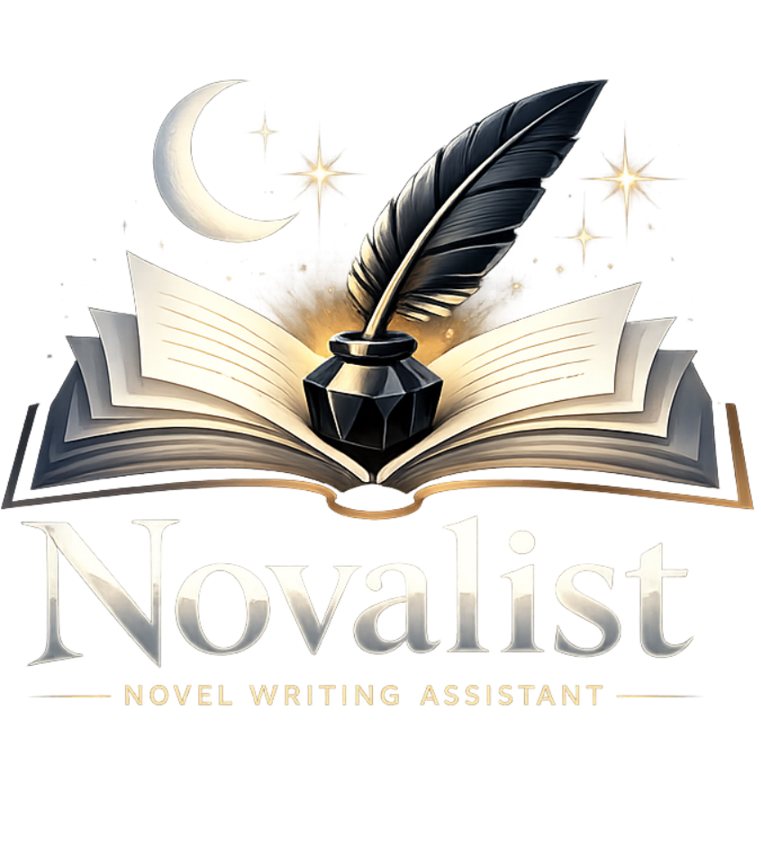
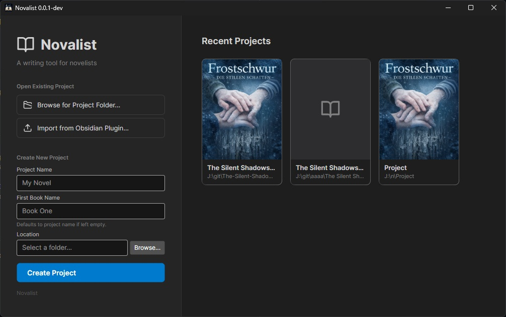
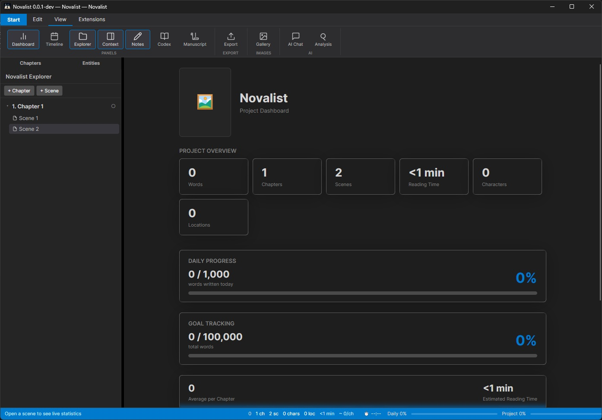
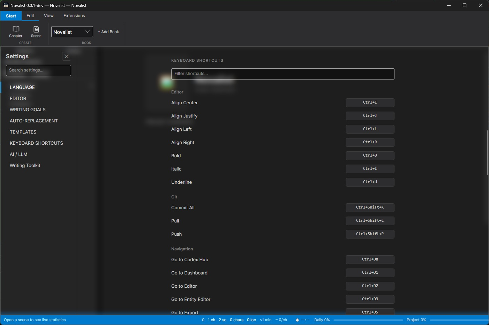

<p align="center">
  
</p>

<h3 align="center">A desktop novel-writing application for authors who want to stay organized.</h3>

---

> **Disclaimer**
>
> Novalist Standalone is provided as is. It was originally developed to help me write my book and may occasionally be updated from my internal version. However, there is no guarantee of ongoing maintenance of the project. Users are free to open pull requests to be merged into the repository or fork it to customise it to their liking.

---

## What is Novalist?

Novalist is a desktop application built for writing novels. It handles the full scope of a writing project -- manuscript editing, world building, character management, timelines, and exporting -- in a single, self-contained tool. It runs on Windows and macOS using .NET 8 and Avalonia UI.

Rather than scattering notes across separate apps or browser tabs, Novalist keeps everything about your project in one place: your chapters and scenes, a world bible of characters, locations, items, and lore, a visual timeline, an image gallery, and an integrated AI assistant for story analysis.

<p align="center">
  
</p>

## Features

### Writing and Manuscript

- Rich text editor backed by WebView2 with spellcheck support
- Organize books into chapters and scenes with status tracking (Outline, First Draft, Revised, Edited, Final)
- Scene-level metadata: point of view, emotion, intensity, conflict, and custom tags
- Scene notes panel alongside the editor for quick reference
- Multi-book projects with a shared World Bible across all books

<p align="center">
  
</p>
<p align="center"><em>The main interface: ribbon toolbar for quick access to all views, chapter explorer on the left, and the project dashboard with word counts, daily progress, and goal tracking.</em></p>

### World Building

- **Characters** -- Detailed profiles with demographics, relationships, roles, groups, and custom properties. Per-chapter overrides to track how characters change throughout the story.
- **Locations** -- Hierarchical location types with descriptions and custom fields.
- **Items** -- Objects with origins, types, and descriptions.
- **Lore** -- Categorized entries for organizations, cultures, history, and other world-building material.
- **Templates** -- Create reusable templates for each entity type to keep your data consistent.
- **Fast Peek Cards** -- Preview any entity without leaving the editor.

### Timeline

Manual timeline events linked to specific chapters and scenes. Categorize events as plot points, character events, or world events to keep track of your story's chronology.

### AI Assistant

A built-in extension that provides a chat-based AI interface for working with your manuscript. Supports LMStudio (local inference) and GitHub Copilot as providers. Configurable parameters for temperature, context length, and other model settings. Analysis modes include:

- Checking for character reference inconsistencies
- Identifying story inconsistencies
- Generating scene statistics
- Providing revision suggestions

The assistant uses dynamic prompt templating with context from your project entities, so it understands the characters, locations, and lore you have already defined.

### Export

Export your manuscript in multiple formats:

- EPUB
- DOCX
- PDF
- Markdown

Includes title page customization for each export format.

### Git Integration

Built-in version control through Git. View branch status, see ahead/behind counts, and commit, push, or pull directly from the application.

### Extension System

Novalist has a plugin architecture through the Novalist SDK. Extensions can contribute ribbon buttons, sidebar panels, content views, settings pages, and editor integrations. Extensions are .NET 8 class libraries discovered at runtime from a plugins folder. See the [Extension Guide](docs/extension-guide.md) for details.

### Localization

Multi-language UI support with locale JSON files. The editor respects the language setting for spellcheck and context menus.

### Keyboard Shortcuts

All keyboard shortcuts are fully customizable. Rebind editor actions, Git operations, and navigation commands to fit your workflow.

<p align="center">
  
</p>
<p align="center"><em>The keyboard shortcuts settings page with filterable shortcut list and rebindable keys.</em></p>

## Building

```
dotnet build Novalist.Desktop/Novalist.Desktop.csproj
```

## Project Structure

```
Novalist.Desktop                    Desktop application entry point, views, and view models
Novalist.Core                       Core library: models, services, serialization
Novalist.Sdk                        Extension SDK: interfaces, hooks, and host services
Novalist.Extensions.AiAssistant     Bundled AI assistant extension
```

## Support the Project

If you find Novalist useful and want to support its development:

[](https://www.paypal.com/donate/?hosted_button_id=EQJG5JHAKYU4S)

[Buy me a coffee on Ko-fi](https://ko-fi.com/drommedhar)

## License

[MIT](LICENSE)