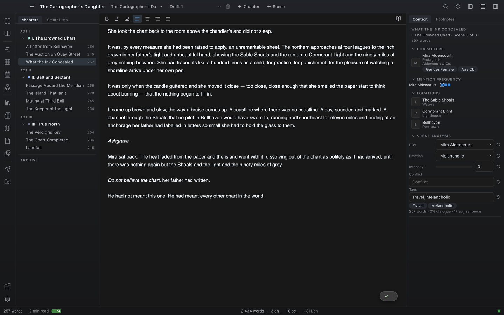

<p align="center">
  
</p>

<h3 align="center">A desktop novel-writing application for authors who want to stay organized.</h3>

<p align="center">
  <a href="https://github.com/Drommedhar/novalist-official/actions/workflows/ci.yml">
    
  </a>
  <!-- Live: CI publishes coverage.json to the `badges` branch (eng/Publish-CoverageBadge.ps1).
       Gated at 100% by eng/Check-Coverage.ps1, so the build fails below that. -->
  
</p>

---

> **Disclaimer**
>
> Novalist Standalone is provided as is. It was originally developed to help me write my book and may occasionally be updated from my internal version. However, there is no guarantee of ongoing maintenance of the project. Users are free to open pull requests to be merged into the repository or fork it to customise it to their liking.

---

## What is Novalist?

Novalist is an offline-first desktop application for writing novels. It handles the full scope of a writing project — manuscript editing, worldbuilding, plotting, timelines, exporting, and version control — in a single, self-contained tool. It runs on Windows, macOS, and Linux: an Electron + React interface in front of a bundled .NET 8 core process that owns all project logic.

Rather than scattering notes across separate apps, browser tabs, and Markdown files, Novalist keeps everything about a project in one folder of plain files: chapters and scenes as HTML, entities and metadata as JSON, images and research alongside. The folder is yours — back it up, sync it, version-control it, edit it with any text editor when Novalist is closed.

## Documentation

A full **User Manual** lives in [`docs/manual/`](docs/manual/README.md). It covers every feature in detail with cross-linked pages for getting started, the interface, projects and books, the editor, worldbuilding, plotting, exporting, extensions, hotkeys, and troubleshooting.

For extension authors, the [Extension Guide](docs/extension-guide.md) walks through the SDK, hooks, packaging, and store submission.

## Features

### Interface

- **Activity-bar layout** — a slim icon rail on the far left switches views, the binder (chapter/scene tree and smart lists) sits beside it, the active view fills the center with an optional scene-notes dock beneath the editor, and a context sidebar is on the right.
- **Scene context & analysis inspector** — the right sidebar's **Context** tab shows the entities present in the current scene, a cross-chapter mention matrix, and an auto-computed scene analysis (POV, emotion, intensity, conflict, tags) with manual overrides; the **Footnotes** tab lists footnotes and comments. Synopsis and notes live in the bottom scene-notes dock; snapshots in a toolbar dialog.
- **Command palette** (`Ctrl+Shift+P`) and number-key view switching for keyboard-driven navigation.
- On macOS 26+ the window uses native **Liquid Glass**, with vibrancy on older macOS; Windows and Linux render opaque themed surfaces from the same design tokens.

### Writing

- WYSIWYG editor with inline formatting, paragraph styles (heading, subheading, block quote, verse), bulleted and numbered lists, inline comments, and numbered footnotes — every style carried through to DOCX, EPUB, Markdown and LaTeX.
- Auto-save with per-scene **snapshot history** and a side-by-side compare view — revert a single scene without touching the rest of the project.
- **Focus Mode** that hides every panel except the editor.
- **Split editor** for editing two scenes side by side.
- **Auto-replacements** for smart quotes, em-dashes, and ellipses with language presets (English, German, French, Spanish, Italian, Portuguese, Russian, Polish, Czech, Slovak).
- **Dialogue punctuation correction** as you type.
- **Offline spell check** using the operating system's own checker — no server, no account, no network — with a personal dictionary that travels with your settings.
- **Grammar check** via LanguageTool (public endpoint by default; self-hosted endpoint supported).
- Live word count, reading time, and Flesch readability score in the status bar; per-chapter readability in the Project Overview.

### Project structure

- Multi-book projects with a shared **World Bible** for entities used across books.
- Chapters with status tracking (Outline → First Draft → Revised → Edited → Final), optional acts, optional in-world date ranges, label colors, and favorites.
- Scenes with synopsis, notes, label color, plotline membership, in-world date range, POV / emotion / intensity / conflict / tags (auto-detected with manual overrides).
- **Smart Lists** — saved scene queries by status, POV, tag, or plotline.
- **Writing sprints** — a status-bar timer with words-this-sitting, live pace, and a per-project history.
- **Manuscript import** — bring an existing book in from Word, OpenDocument, EPUB, Markdown, plain text, RTF, or a **Scrivener** project. Chapters and scenes are worked out from the document's own heading styles, with a preview of the whole plan before anything is written; imports append rather than replace.
- **Filesystem is the source of truth** — add, move, rename, or delete scenes and chapters with any file manager and Novalist reconciles the changes, both on open and live while running. Scene identity travels in a one-line comment in each file; chapter identity in a hidden folder marker.

### Worldbuilding (Codex)

- **Characters** with name/surname, gender, age (manual or computed from birth date and the in-world calendar), role, group, physical traits, images, relationships, and per-act / per-chapter / per-scene overrides for any field as well as for images, relationships, and sections.
- **Locations** with hierarchical parents, types, and custom fields.
- **Items** with origin, type, and description.
- **Lore** entries for magic systems, religions, history, in-world books.
- **Custom entity types** — define your own (Factions, Spells, Vehicles, Races, …) with custom field schemas.
- **Templates** per entity type with default sections, custom properties, and field defaults.
- **Sections** of long-form content per entity, written in a formatted text box: headings, bold, lists, and links are styled as you type and their syntax stays hidden until you edit the line, with a toolbar so you never need to learn it. Stored as plain Markdown.
- **Relationships** with auto-learned inverse-role pairs and inverse-prompting on new relationships.
- **Focus peek** card on entity hover inside the editor.
- **Wiki** — a read-only, Wikipedia-style reader over the whole Codex: one cross-linked article per entity with a lead descriptor, table of contents, infobox and image gallery, sections, relationships and reverse "referenced by", an at-a-glance stats strip, "appears with", plotlines, map pins, a per-entity Appearances timeline built from the scenes that mention it, and an optional on-demand AI summary (when an AI extension is installed).

### Planning & visualization

- **Plot Grid** — spreadsheet view of plotlines (rows) by scenes (columns); toggle scene membership in a thread with a click.
- **Timeline** — chronological view of acts, chapters, scenes, and manual events with vertical/horizontal layout and day/week/month/year zoom.
- **In-world Calendar** — Week, Month, and Year layouts; scenes and events appear on their in-world dates. **Custom calendars** let you define your world's own months, month lengths, weekday names and year label, so durations are counted in your world's time rather than forced into Gregorian months and a seven-day week.
- **Relationships graph** — auto-clustered force-directed graph of characters with family detection in English and German.
- **Dialogue** — every line one character speaks, gathered across the book and grouped by story time, so voice drift is readable end to end. Speakers are detected offline from entity mentions, speech verbs, same-paragraph continuation, pronoun tags the narration can only mean one way, and back-and-forth alternation; each line is labelled with how it was worked out, and anything less than certain offers its likely speakers with percentage shares you can click to assign. Lines can be rewritten in place and land straight in the scene file.
- **Manuscript view** — read the whole book end-to-end, switch to Corkboard for index-card planning, or Outliner for a sortable scene table.
- **Maps** — interactive layered map view: recursive layer tree with drag-and-drop nesting, per-layer opacity / lock / zoom-range / floor-stack mode; per-image rotate, resize, polygon clip mask; entity-linked colour pins; text labels; road & river spline tool with typed profiles (casing, fill, lane markings) and per-point width; terrain shapes (grass, forest, sand, …) with feathered, blendable edges and z-ordering; typed buildings (homes, schools, stations, …) with procedurally-generated footprints that snap to roads and optional multi-floor interior plans (walls, doors, windows, stairs); a freeform clip border that frames the whole map; **PNG export** at 1x/2x/4x for e-book or print, and a one-click **3D view** — a GPU-rendered, free-fly walkthrough of the whole map with extruded buildings, sloped roofs, interiors, terrain and roads.
- **Planning board** — an infinite canvas of loose cards and author-drawn labelled connectors, for ideas that are not scenes yet. Nothing on a board is part of the manuscript until you promote a card, which creates a scene with the card's text as its synopsis and leaves the card pointing at it. Many boards per project, stored as plain JSON beside the maps.
- **Style report** — deterministic, offline craft checks over a scene, a chapter, or the whole book: adverbs, filter words, weak verbs, passive voice, stock phrases, sticky sentences, repeated sentence openers, and sentence-length variation. Word lists come from the same per-language analysis file as scene analysis, and a language without a list is reported as unsupported rather than shown as a clean zero. No AI, no network.
- **Dashboard** — totals, status breakdown, chapter pacing, echo phrases, daily / project word goals with deadlines, plus a wide project banner and a portrait book cover (the cover shows for each project on the welcome screen).

### Research & assets

- **Research view** — notes, links, files, images, and PDFs attached to the project with tags and search.
- **Image Gallery** — every project image at a glance with lazy thumbnails, search, and copy-path / reveal actions.
- Add images from file, clipboard, URL, or the existing project gallery.

### Output

- Export to **EPUB**, **DOCX**, **PDF**, **Markdown**, **Final Draft**, **LaTeX**, and the codex world bible as **Markdown** or a self-contained **PDF** with inlined images.
- **Publishing metadata** — ISBN, publisher, series and position, description, subjects, rights and date, written into the EPUB the way retailers read it.
- **Front and back matter** as typed book elements — half title, copyright, dedication, epigraph, foreword, prologue, epilogue, acknowledgments, about the author, also-by and custom pages, each laid out per kind rather than faked as a chapter. EPUB gets the correct `epub:type` per page; DOCX starts each on a new page.
- **Layout presets** — Default, **Shunn Manuscript Format** (industry-standard submission format), Ebook Flow, and **Normseiten** (German standard pages: 60 characters per line, 30 lines per page, exact page count) set fonts, spacing, and margins, alongside any layout you author yourself.
- **Exposé** — a per-book pitch document with its own editor, live character and Normseiten counts against limits you set, and a Normseiten DOCX export.
- Chapter-level selection with select-all / select-none, per-entry selection for codex exports, optional title page, custom title and author.
- Extensions can contribute additional formats and presets.

### Version control

- **Automatic backups** — the whole project folder archived to a rotating ZIP outside the project, on open, on close, and on a timer, with one-click restore from Settings. The `.git` folder is skipped, and restoring archives the current state first so it can be undone.
- Built-in **Git** client — stage, commit, push, pull from the app; branch and changed-file count in the status bar.
- Per-scene snapshot history is complementary to Git for fine-grained, per-file recovery.

### Find & Replace

- Plain-text, whole-word, case-sensitive, or .NET regex search.
- Scope to the current scene, the selection, the active book, or every book in the project.
- Replace one or all matches; snapshots cover the replacements.

### Customization

- **Hotkeys** — every action is rebindable; defaults documented in [`docs/manual/26-hotkeys.md`](docs/manual/26-hotkeys.md).
- **Command Palette** (`Ctrl+Shift+P`) — every action by name.
- **Localization** — English, German, and Simplified Chinese ship in the box. Drop a JSON locale file into your `Locales/` folder to add a language or patch a bundled one; anything a partial translation omits falls back to English.
- **Theme** — the default palette is Novalist's own: deep "Ink Night" paper, parchment text, and gilt accents, set in Fraunces, Newsreader, and Courier Prime (all three ship with the app, so it looks the same offline and on every machine). Bundled Discord, High Contrast and Catppuccin Mocha palettes and a custom accent color are also available; on macOS 26+ the window uses native Liquid Glass, with a vibrancy fallback on older macOS.
- **Custom themes** — write your own palette as a JSON design-token map or a CSS stylesheet, drop it into your `Themes/` folder, and it joins the theme picker. Extensions can contribute themes the same way. See [`docs/manual/34-custom-themes-and-languages.md`](docs/manual/34-custom-themes-and-languages.md).
- **Global or per-project settings** — appearance, editor, and writing-assistance settings default to global but can be overridden per project (e.g. an English book and a German book each with their own language, quotes, and theme); project overrides live in `.novalist/` and sync via git.
- **Reading comfort** — line height, letter spacing and paragraph spacing are yours to set, in the editor, in Manuscript mode and in the Expose; a High Contrast theme ships for low vision and for bright rooms. See [`docs/manual/39-accessibility.md`](docs/manual/39-accessibility.md).
- **Git** — stage, commit, push and pull from inside the app, plus a commit history with per-commit file lists and diffs, branch create/switch, and one-click repository creation.
- **Snapshots** — per-scene version history that restores the whole scene (synopsis, notes, POV, stage, dates, plotlines), plus a project-wide manager with renaming and pruning.
- **Export preview** — how many chapters, scenes and words the current selection would produce, and how long the book runs in the chosen layout, before you write the file.
- **Print** — `Ctrl+Alt+P` prints the open scene, the whole book in Manuscript mode, or whatever view is on screen, without the application chrome.
- **Your own rating axes** — chart any numeric scene field of yours across the book, beside the tension curve.
- **Freeform corkboard** — drag scene cards anywhere; the arrangement is saved with the book.
- **Your own typed fields** — on scenes, chapters, plotlines, timeline events and research items, not just Codex entries.
- **Chapter trash** — a deleted chapter and its scenes are recoverable, with restore and an explicit delete-forever.
- **Draft comparison** — two drafts side by side, scene by scene, with a line diff and per-scene cherry-pick back into the draft you are in.
- **Named milestones** — keep a whole-project archive under a name like "first draft" that retention never rotates out.
- **Structured search** — `title:`, `text:`, `notes:`, `tag:` and `kind:` scoping, `-` to exclude, quotes for a phrase, and ranked results.
- **Relationship graph** — characters, locations, items and lore on one graph, with ties coloured by the kind you give them.
- **Rich Codex sections** — pipe tables, fenced code and Obsidian-style callouts, written from the toolbar and rendered in the Wiki.
- **Arrangeable Codex sheets** — hide the fields a project does not use (values kept) and reorder the rest, per entry type.
- **Research media** — read PDFs, play audio and watch video inside the Research view rather than in another application.
- **Accessible output** — describe every image, see before exporting how many are undescribed, and ship an EPUB whose accessibility metadata reflects what the file actually contains.
- **Series view** — every book in the project at once, with a cell per book showing where each shared World Bible entry appears; a gap mid-row is a dropped thread.
- **Plot grid** — cross your scenes with plotlines, or with characters, locations, items or lore; a ticked Codex cell records who is in the scene.
- **Saved lists** — rules with AND/OR over status, POV, tags, plotlines, your own fields, and who is in the scene; apply one to narrow the whole Manuscript view.
- **Scene templates** — capture a scene that reads the way you want and start new ones from it: synopsis, prose skeleton, POV, stage, label, tags and plotlines.
- **Tags** — one vocabulary across scenes, Codex entries and research notes, with colours, counts, and rename/merge that reaches every holder at once.
- **Chapter openers** — a subtitle under the title, a heading you can suppress per chapter, and drop caps with small-capital lead-ins set on the export layout.
- **Images in the prose** — insert a picture into a scene with alt text; it is copied into the book, stored as a portable path, and carried into EPUB, DOCX, PDF, Markdown and LaTeX.
- **Compile control** — hold any scene back from exports without archiving it, and export only the scenes at the stages you name.
- **Readability marking** — tint the sentences that fight the reader, graded one at a time with the same method the style report uses, without touching the scene.
- **Read aloud** — the editor reads the scene back from the caret with a system voice, highlighting the sentence it is on, in the language the scene is written in. Nothing leaves the machine.
- **Book preview** — render the editor as a printed page with configurable trim size and book font.

### Extension system

Novalist has a plugin architecture through the **Novalist SDK**. Extensions can contribute:

- Webview panels that appear as activity-bar view icons under Extensions (SDK v2)
- Editor hooks (lifecycle, inline actions, grammar checks)
- Export formats
- Custom entity types and custom property types
- AI integration hooks (prompt building, response processing)
- Colour themes (a design-token map or a stylesheet), listed in the Settings theme picker

Extensions are .NET 8 class libraries loaded by the core process at runtime from the user extensions folder; their UI is delivered as sandboxed webviews. The bundled AI Assistant is the reference example, contributing the AI Chat, Character Chat, and Story Analysis panels. See the `Novalist.Sdk.Example` project for a working implementation.

The Extensions view has a built-in **store**: browse the online extension gallery, read each extension's README and release notes, and install or update extensions in place (with download progress and a cancel option) without leaving the app. It can also check installed extensions for updates on startup.

## Building

Novalist is an Electron + React front end over a bundled .NET 8 core process (`Novalist.Backend`).

```
# build the backend the app spawns, then run the app in development
dotnet build Novalist.Backend/Novalist.Backend.csproj
cd app
npm install
npm run dev
```

To produce distributable installers for the current platform:

```
cd app
npm run package
```

## Project structure

```
app/                  Electron + React front end — renderer, main, preload
Novalist.Backend      .NET 8 core process the app spawns (JSON-RPC over stdio)
Novalist.Core         Core library — models, services, serialization, localization, utilities
Novalist.Sdk          Extension SDK — public interfaces, hooks, host-service contracts, descriptor models
Novalist.Sdk.Example  Reference extension demonstrating the hook types
docs/                 User manual, extension guide, screenshots
```

## Support the Project

If you find Novalist useful and want to support its development:

[](https://www.paypal.com/donate/?hosted_button_id=EQJG5JHAKYU4S)

[Buy me a coffee on Ko-fi](https://ko-fi.com/drommedhar)

## License

[MIT](LICENSE)
