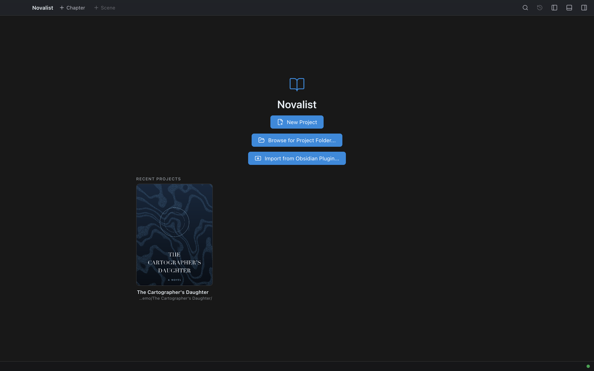

# Getting Started

This page walks you from a freshly installed Novalist to writing your first scene. It takes about ten minutes.

If you already have Novalist open and just want to find your way around, skip to [Interface Overview](02-interface-overview.md).

## Installing Novalist

Novalist is a desktop application. The user interface is an Electron shell; all project logic runs in a bundled core process ("Novalist Core") that the app starts automatically — you never manage it yourself.

Download the latest release for your platform from the project's release page:

- **Windows** — run the installer (`.exe`, NSIS).
- **macOS** — open the `.dmg` and drag Novalist into Applications.
- **Linux** — download the `.AppImage`, make it executable, and run it.

No account is required. Novalist works fully offline. The only times it touches the network are:

- Checking for application and extension updates (toggleable in [Settings](23-settings.md)).
- Browsing the extension store.
- Calling the LanguageTool grammar service when grammar check is enabled (toggleable, and the endpoint can be replaced with a self-hosted server).

## First-time guidance

The first time you open a project, a small card appears in the corner offering a walk through the app. It is eight stops — Dashboard, Manuscript, the writing view, Focus Peek, Codex, Timeline, Research, Export — and each one **actually goes there** rather than describing it, so you have been in the rooms once before you need them.

Each stop names **one thing to do** rather than only describing what you are looking at: open a scene and write a sentence, set a daily goal you can reach, capture one fact you will want beside the draft. **Try this** does the part that needs doing for you where it can — on the Focus Peek stop, **Point it out** finds a linked name in your scene and shows you what hovering it would do.

A stop that needs something you do not have yet says so instead of failing quietly. With no scene open, the writing stop tells you to open one from the binder first; with no linked names in the scene, the Focus Peek stop says that too, rather than asking you to hover something that is not there.

Novalist has eighteen views behind four groups in the activity bar. The manual covers all of them, and nobody reads a manual before they have a reason to; the tour exists so the Plot Grid is not a surprise in month three.

**Skip** is as prominent as **Next** — if you already know the app, one click and it is gone. It is offered once per installation and never asks again. To take it later, press **Ctrl+Alt+T** or find **Take the tour** in the command palette.

### Tips as you go

Beyond the tour, Novalist offers a short tip the first time a feature actually becomes usable — when your caret first lands on a linked Codex name, for example, rather than in a lesson before you have any. Each tip can be tried, put off, or turned off for good, and Novalist remembers only which tips you have seen: no part of your writing is recorded to decide when to show one.

Turn the whole thing off under **Settings → Accessibility → Show contextual guidance while I learn**.


## The start screen

When you launch Novalist with no project open, the **start screen** appears. It offers:




- **Recent Projects** — projects you have opened before, newest first. Each entry shows the project's portrait **book cover** (set on the [Dashboard](11-dashboard.md#banner-and-book-cover)) — or a placeholder when none is set — above the project name and its folder path; click one to open it.
- **Browse for Project Folder...** — opens a folder picker. Point it at any folder that contains a `.novalist/` subdirectory (a Novalist project). Projects created with earlier versions of Novalist open unchanged — the on-disk format is the same.
- **Import from Obsidian Plugin...** — converts a project produced by the legacy "Obsidian Novalist Plugin" into a native Novalist project: pick the vault folder, Novalist detects the plugin projects inside it, choose the output folder and names, and run the import. The new project opens when the import finishes and an `import-log.txt` is written into it. See [Troubleshooting](28-troubleshooting.md) for details.

## Opening your first project

Pick a project from the recents list, or use **Browse for Project Folder...** and select your project folder. The start screen disappears and the workspace opens.

The workspace has three panes: the **binder** on the left (chapters, scenes, and the navigation rail), the **main area** in the center, and the **inspector** on the right. The status bar at the bottom shows **Core connected** with a version number once the bundled core process is up. See [Interface Overview](02-interface-overview.md) for the full map.

## Creating a chapter and a scene

1. In the toolbar at the top, click **Chapter**. A dialog asks for a chapter name — type `Chapter 1` and confirm.
2. The new chapter appears in the binder tree. Click **Scene** in the toolbar, name it `Opening`, and confirm. The scene is added to the chapter of the currently open scene (or the last chapter when nothing is open).
3. Click the scene in the binder — it opens in the **Editor**.

You can also manage chapters and scenes by right-clicking them in the binder. See [Chapters & Scenes](04-chapters-and-scenes.md).

## Writing

Type into the editor. As you write:

- The **status bar** (bottom-left) shows the live word count of the open scene; the center shows project totals (words, chapters, scenes).
- The editor **saves automatically two seconds** after you stop typing. Pending changes are also flushed when you switch scenes or close the app.
- The **scene-notes dock** at the bottom (toggle it from the toolbar) holds the scene's synopsis and notes, and the **inspector** on the right shows the scene's context and footnotes.
- Take a **snapshot** from the toolbar before a risky edit and restore it later. See [Snapshots](17-snapshots.md).

## Where things live

A project is a plain folder of plain files:

```
My First Novel/
├── .novalist/                  # JSON manifests (do not edit by hand)
│   ├── project.json
│   ├── settings.json
│   └── ...
├── <BookFolder>/
│   ├── Drafts/
│   │   └── <DraftFolder>/
│   │       └── <ChapterFolder>/
│   │           └── <Scene>.novalist   # one file per scene
│   ├── Characters/
│   ├── Locations/
│   ├── Items/
│   ├── Lore/
│   ├── Images/
│   └── Snapshots/
└── WorldBible/
```

The structure is easy to read with any text editor, easy to back up, and easy to version-control with Git. See [Projects & Books](03-projects-and-books.md) for the full layout and the rules for editing it outside Novalist.

## Next steps

Now that you have a working project, here are the most useful things to learn next:

- [Interface Overview](02-interface-overview.md) — every part of the window and what it does.
- [Editor](05-editor.md) — formatting, page view, two scenes at once, grammar check.
- [Codex](06-codex.md) — create your first character or location.
- [Dashboard](11-dashboard.md) — set up your daily word goal.
- [Hotkeys reference](26-hotkeys.md) — every keyboard shortcut.
