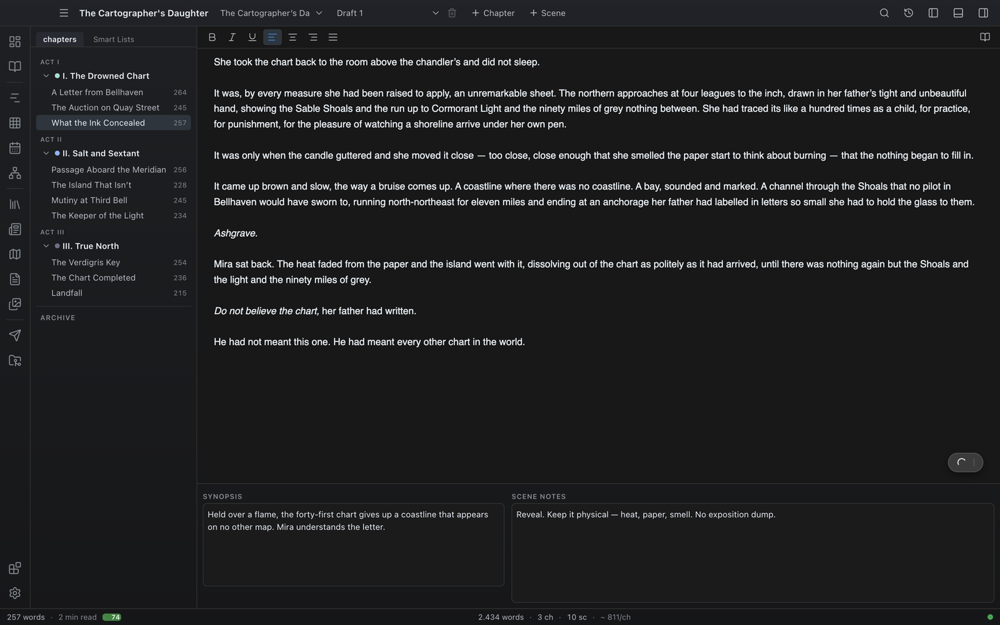

# Editor

The Editor is where you write. It is a WYSIWYG rich-text editor. Each editor pane keeps a strip of open scene tabs, and you can show a second pane side by side. The writing engine is the same proven one as in earlier Novalist versions — typewriter scrolling, page view, comments, and footnotes all behave identically; only the shell around it is new.

Shortcuts below are written with `Ctrl`; on macOS use `Cmd`.

## Opening a scene

Click any scene in the **binder**. The main area switches to the Editor view and loads the scene; the open scene is highlighted in the binder, it is added to the pane's tab strip, and its statistics appear in the [status bar](#status-bar-statistics).

The Editor has no view-rail icon of its own — you always reach it by opening a scene from the binder.

## Scene tabs

Each editor pane keeps the scenes you have opened as a **tab strip** across the top of the pane. Clicking another scene in the binder adds it as a new tab instead of replacing the current one, so you can keep several scenes open and jump between them.

The strip appears once a pane has more than one scene open (a single open scene keeps the clean, strip-free look). Each tab shows:

- The scene title (falling back to the chapter title for an untitled scene).
- A small **dirty dot** while the scene has unsaved edits, which clears once autosave flushes.
- A **close** button (`×`).

Tab actions:

- **Click** a tab to switch the pane to that scene.
- **Middle-click** a tab, or click its `×`, to close it. Closing the active tab activates its neighbour.
- **Right-click** a tab for a small menu: **Close tab** and **Move to other split** (sends the scene to the other editor pane, opening the split if needed).

## Auto-save

Novalist saves automatically **two seconds** after the last keystroke. Pending changes are also flushed when you switch to another scene and when the app closes — there is no manual save step.

## The formatting toolbar

The strip above the page:

- **Bold**, **Italic**, **Underline** — toggle inline formatting on the selection.
- **Align left / center / right / justify** — set paragraph alignment.
- **Page view toggle** (book icon, far right) — switches the editor between a plain writing surface and a printed-book-style page with paper background, margins, and shadow. This is the same setting as **Page View** in [Settings](23-settings.md) → Editor.

The active formatting of the text under the caret is highlighted in the toolbar.

## Paragraph styles

Beyond inline formatting, a paragraph can carry a **named style** — *heading* or *subheading*. Styled paragraphs are drawn larger and bolder in the editor, and the [export](20-export.md) formats that have a notion of headings treat them as one instead of as body text: Markdown writes them as `#` and `##`, LaTeX as `\section*` and `\subsection*`, and the Normseiten layout upper-cases them and sets them off with blank lines. (The Exposé applies a slightly different rule to its title line — see [Exposé](32-expose.md).)

The scene toolbar has **no control for applying a style**. Scene paragraphs carry one only if the content already had it — projects written in an older version of Novalist, whose editor offered a style dropdown.

Pasting a heading from a web page or a Word document does not create one. The paste keeps the heading tag, but every export reads text out of paragraphs, so a pasted heading is dropped from the exported file entirely. If you paste a structured document into a scene, re-type its headings as ordinary paragraphs.

Where paragraph styles are applied by hand is the [Exposé](32-expose.md) view, which has Title / Section / Body buttons above its editor. That is the document type whose structure depends on them.

## The editor context menu

Right-click inside the text for:

- **Cut / Copy / Paste / Select All** — pasting strips foreign formatting and keeps only basic bold/italic/underline and alignment.
- **Add comment** — on a selection: attaches a comment to the selected text. Commented passages are marked in the text; click the marker to read or edit the comment.
- **Add footnote** — inserts a footnote at the caret. Footnotes are numbered sequentially within the scene and renumber automatically when one is deleted.
- **Add to Dictionary** — on a word flagged by the spell check: whitelists it.
- **Create entity from selection** — on a selection: makes a new [Codex](06-codex.md) entry named after the selected text (you pick the kind) and turns the selection into a mention of it. The same flow as the `@` picker's Create row, described below.
- **Add selection to entity** — on a selection: copies the passage into one of an existing entity's sections. Pick the entity from a searchable list, name the section (it defaults to **Notes** and is created if it does not exist yet), and confirm. Your prose is left exactly as it was — the passage is copied, not moved.

The last two exist so that worldbuilding you invent mid-sentence can reach the Codex without breaking your writing flow. A description of a city you just wrote can become that location's "Appearance" section in two clicks.

## Split editor

To see two scenes at once, right-click a scene in the binder and choose **Toggle split editor**. The main area splits into two editor panes: your current scene on the left, the chosen scene on the right. Both panes are fully editable, auto-save independently, and each keeps its own [tab strip](#scene-tabs) of open scenes. Use **Move to other split** on a tab to hand a scene from one pane to the other.

Common uses: referencing an earlier scene while writing a later one, or editing two scenes in parallel.

## Entity mentions and autocomplete

Novalist recognises the names of your [Codex](06-codex.md) entities — characters, locations, items, and lore — as you write, matching both the primary name and any aliases.

Type `@` to open the **mention autocomplete**: a picker of matching entities (by name or alias) appears; choose one to insert its name. This is the quickest way to keep names spelled consistently across the manuscript.

### Creating an entity from the name you just typed

The picker never dead-ends on a name that does not exist yet. As soon as you have typed something after the `@`, the last row of the picker is **Create "<name>"** — pick it (click, or select it with the arrow keys and press Enter) and Novalist asks which kind of entry to make: Character, Location, Item, Lore, or any of your custom types. Choose one and:

- the entity is created in the [Codex](06-codex.md) with that name,
- the text you typed becomes a real mention linked to it, and
- the name is immediately recognised everywhere else — hover cards, the Inspector, the [Wiki](30-wiki.md) Appearances timeline, and future `@` picks.

You never leave the page or lose your place. If you cancel the type chooser, the text stays exactly as you typed it, as ordinary prose. Fill in the details later in the Codex — the point is to capture the name at the moment you invent it.

## Entity hover cards

When you hover over the name or alias of a codex entity in your prose (or over an inserted mention), an enriched **hover card** appears with, as available:

- The entity's **image** and **name**, plus a **type** label (Character / Location / Item / Lore).
- A short **detail** line.
- A couple of key **attribute chips** — for a character its role, gender, and age; for a location its type and parent; and so on.
- Up to a few **relationships** (`role: target`).
- The entity's **section** titles.
- An **Open entity** button that opens that entity's article in the [Wiki](30-wiki.md) (from there, **Edit in Codex** jumps to the editable record).

The card is enough to check a character's face, a relationship, or a location without leaving the editor. Move the pointer onto the card to keep it open. Entities are managed in the [Codex](06-codex.md).

## Grammar and spelling check

When **Grammar & Spelling Check** is enabled in [Settings](23-settings.md) → Writing assistance, Novalist sends your text to a LanguageTool-compatible API and underlines issues inline. Click an underlined passage to see suggestions and apply one.

By default the free public LanguageTool endpoint is used; the URL is configurable to point at a self-hosted server (to keep your text local), and Premium credentials, picky mode, and a mother-tongue setting for false-friend detection are available in the same settings section. Use **Add to Dictionary** in the context menu for names the spell check keeps flagging.

## Auto-replacements

As you type, certain character sequences are converted automatically based on the **Quote Style** language preset in Settings → Writing assistance:

- `--` becomes an em-dash.
- `...` becomes an ellipsis.
- Straight quotes become the curly quotes of the selected preset (English curly quotes, German low quotes, French guillemets, and others).

Replacements only fire as you type; pasted text is left alone.

## Dialogue correction

When **Dialogue Punctuation Correction** is enabled in Settings → Writing assistance, common dialogue punctuation mistakes are fixed as you type, following the conventions of the selected quote-style language — for example a period before a dialogue tag becomes a comma. Disable it if you have your own house style.

## Typewriter scrolling and page styling

In [Settings](23-settings.md) → Editor:

- **Typewriter Scrolling** keeps the active line at a fixed vertical position (top, middle, or bottom) so you never write at the bottom edge of the window.
- **Page View** renders the editor as a book-style page (also toggleable from the formatting toolbar).
- **Book Page Width** constrains the text column to a printed page width, with selectable page formats, and **Book Font** / **Book Font Size** set the typeface for that mode.
- **Book Paragraph Spacing** adds book-like vertical spacing.
- **Font Family** and **Font Size** control the regular editing view. New projects start on Newsreader at 17px — the app's own text face, bundled so it is always available — but the field takes any family installed on your machine.

All of this is purely visual — it doesn't change what gets exported. For export styling see [Export](20-export.md).

## Keyboard shortcuts and zoom

The editor participates fully in the app's keyboard shortcuts even while the caret is inside the text: a global gesture (for example the command palette, focus mode, or find & replace) fires whether or not the editor has focus, so you never have to click out of the page first. See [Hotkeys](26-hotkeys.md) for the full list.

Hold `Ctrl` and scroll the mouse wheel over the page to **zoom** the editor font up or down (clamped to a sensible range). The zoom adjusts the editor font size, the same value exposed in [Settings](23-settings.md) → Editor.

## Status bar statistics

While a scene is open, the left of the status bar shows live figures for that scene, recomputed as you type:

- **Word count** and **character counts** (with and without spaces).
- Estimated **reading time** in minutes.
- A **readability badge** — a 0–100 score with a colour-coded label (Very easy, Easy, Moderate, Difficult, Very difficult). The score adapts to the writing language selected under Settings → Writing assistance.
- The **scene title**.

The centre of the status bar shows whole-project totals (words, chapters, scenes); click it for a project overview popover. The right side shows daily and project goal progress when goals are set (see [Dashboard](11-dashboard.md)).

## Focus mode

`Alt+F` hides both side panes so only the toolbar, the page, and the status bar remain. Press `Alt+F` again to bring the panes back. The command palette (`Ctrl+Shift+P`) keeps working, so every command stays reachable while focused.

## Where to go next

- [Chapters & Scenes](04-chapters-and-scenes.md) — the binder tree around the editor.
- [Exposé](32-expose.md) — the same writing surface with paragraph-style buttons and length counters.
- [Snapshots](17-snapshots.md) — revert a single scene to a previous state.
- [Find & Replace](21-find-replace.md) — search across scene, chapter, book, or project.
- [Settings](23-settings.md) — fonts, theme, writing assistance.
