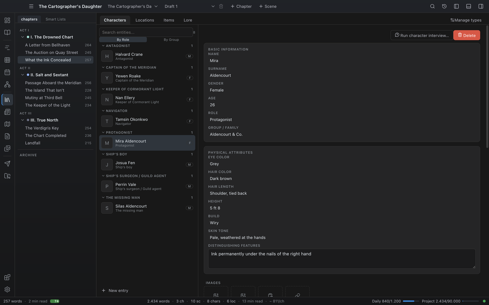

# Codex (Characters, Locations, Items, Lore, Custom types)

The Codex is Novalist's worldbuilding database. Every named thing in your story can live here: people, places, objects, organizations, magic systems, mythology — whatever you need.

Open it via the **Codex** icon in the World group of the activity bar (or **Go → Codex** in the menu bar). This page covers the four built-in entity types, custom entity types, creating entries (including the guided wizard and the character interview), the detail pane, and the World Bible.

For the visual relationship graph see [Relationships](14-relationships.md). For templates that pre-fill new entries see [Templates](07-templates.md).

## The Codex view

Across the top is a **tab strip**: **Characters**, **Locations**, **Items**, **Lore**, one tab per custom entity type (shown by its plural name), and a **Manage types** button (see below).

Below it, the view is split in two: the **navigation column** on the left and the **detail pane** on the right.

### The navigation column

The left column lists every entity of the active type. At the top is a **search box** — filter the list by name as you type — next to a **count** of how many entries currently match. **New entry** at the bottom creates a new entity.

How the list is arranged depends on the type:

- **Characters** are **grouped**, with a **By Role / By Group** toggle above the list. Each group is a collapsible section with a heading and a member count; click a heading to fold or unfold it. Characters with no role/group fall under an "Ungrouped" heading.
- **Locations** are shown as a **parent/child hierarchy tree** — a location whose parent is another location is nested (indented) beneath it, so a city can sit under its region. **Drag a place onto another** to move it there; drop it on the dashed strip at the top of the list to lift it back out of everything. See [Building the place tree](#building-the-place-tree).
- **Items**, **Lore**, and custom types are shown as a flat list.

Each row shows a thumbnail (or the entity's initial), its name, and a short detail line. Characters also show a one-letter **gender badge**, and World Bible entries carry a **WB** badge.

**Right-click** any row for a context menu to **Move to World Bible** / **Move to Book** (see [The World Bible](#the-world-bible-shared-entities)) or **Delete** it (with confirmation).

## The built-in entity types

| Type | What it's for |
| --- | --- |
| **Character** | People. Name and surname, gender, age, role, group, physical traits, relationships, chapter overrides. |
| **Location** | Places. Type (city, forest, ...), parent location, description. |
| **Item** | Objects. Type, description, origin. |
| **Lore** | Abstract worldbuilding entries (magic, religion, history). Category and description. |

All types share images, aliases, sections, custom properties, and templates.

## Editing everything at once

The Codex edits one entry at a time, which is right for writing a character and wrong for filing forty of them: comparing two entries means remembering the first, and putting a house on each of forty means forty trips through the detail pane.

**Table** in the type bar swaps the list-and-detail layout for a grid of every entry of the current type. Each cell is editable in place:

| Type | Columns |
|---|---|
| Characters | Name, Role, Group |
| Locations | Name, What it is, Inside, Group |
| Items, lore, your own types | Name, What it is, Group |

- Type in a cell and click away, or press **Enter**, to save it. **Escape** puts the cell back as it was.
- A rename here cascades exactly as a rename in the detail pane does — the references that name the entry follow it.
- The table is a way of looking at the type, not a setting: it lasts for the session and the Codex opens in its usual layout next time.

Press **Table** again to go back.

## Creating an entry

Click **New entry** at the bottom of the list. The dialog asks for:

- **Name** — the entity's primary name.
- **Template** — optional; pick one of the type's templates to pre-fill fields, properties, and sections. See [Templates](07-templates.md).
- **Use guided wizard** — when checked, a step-by-step wizard opens after creation and walks you through the type's remaining key fields one question at a time (for a character: surname, gender, age, role, group, and a short description that is saved as a "Description" section — the name comes from the dialog). Each step shows a short help text; steps can be skipped, and a review step lets you check everything before finishing.

Confirm with **OK** (or `Enter`).

### Need a name?

Naming is the most frequent thing that stops a draft mid-sentence, so the create dialog carries a generator. Open **Need a name?**, pick a **sound**, and click **Suggest names**; clicking a suggestion fills the name field, where you can still change it before creating anything.

- **Sound** — the syllables a set is built from: soft and flowing, hard and blunt, open and coastal, old and guttural. These are invented sets named for how they sound. Novalist deliberately does not offer "Irish names" or "Japanese names": a handful of syllables cannot represent a real naming tradition, and it would get it wrong in a way you could not see.
- **Ordinary to unusual** — at the left the generator keeps to the commonest sounds in the set; at the right it reaches the whole of it. A slider rather than a switch, because "unusual but still pronounceable" is the setting most people actually want.
- **Again** — a fresh batch. The generator is deterministic, so the same set, slider and seed always produce the same list; a name you liked and did not write down can be reached again by stepping back through.

Everything runs offline. Nothing is sent anywhere and no model is involved.

## The character interview

With a character selected, click **Run character interview...** at the top of the detail pane. The interview walks the seven psychology pillars — **Wound**, **Fear**, **Lie they believe**, **Want**, **Need**, **Secret**, and **Voice** — with a help text for each. Your answers are saved as sections on the character (existing sections with the same titles are updated, not duplicated), so they stay editable afterwards like any other section.

## The detail pane

The right pane holds the editors for the selected entity, from top to bottom:

- **Actions** — **Run character interview...** (characters only) and **Delete** (asks to confirm).
- **Fields** — the type's own fields, laid out as a typed, grouped form with the right control for each field. Changes save when you leave a field.
  - **Characters** get two groups: **Basic Info** (name, surname, gender, age, role, group) and **Physical Attributes** (eye color, hair color, hair length, height, build, skin tone, and a multi-line distinguishing features box).
  - **Group** is on every type, not just characters, and offers the group names this project already uses so a faction is spelled the same way twice. A faction is exactly the thing that spans types — the captain, the ship, the port and the ledger they are all written in belong to the same one, which a character-only field could never say.

### Groups and factions

Group names are free text on each entry, which is fine until you want to correct one. **Settings → Groups and factions** holds the project's list of them, so a group can be more than a string typed the same way twice:

- A **colour**, so a faction is recognisable at a glance rather than only readable.
- A **description** in your own words. Never printed.
- A count of how many entries belong to it, across every type.

**Collect from the Codex** adds every group name your entries already use. Run it once on an existing project — without it the list starts empty, which is no use to whoever already has the most groups. Spelling variants fold together as they arrive.

**Renaming a group renames it everywhere.** Correcting "the Ravens" to "House Raven" used to mean opening every entry that said the first thing; now it rewrites the character, the ship, the port and the ledger in one move. Renaming onto a group that already exists is refused, because merging two factions is something you have to ask for rather than something a typo does.

**Deleting a group takes it off the entries too**, since leaving forty entries claiming a group nobody lists is how this drifts in the first place.
  - **Locations** have name, type, a **parent location** field with autocomplete over the project's other locations (this drives the hierarchy tree in the navigation column), and a description.

### Building the place tree

Reparenting used to mean editing the **parent location** field by hand, which is fine for one change and miserable for reorganising a continent. Places can be **dragged**: drop one onto another and it moves inside it, drop it on the dashed strip above the list and it goes back to the top level. The field still works and still autocompletes; the drag is the fast path.

A place cannot be dropped **inside its own subtree** — into a child, a grandchild, or itself. It looks like a small thing to forbid and it is not: a place that is its own ancestor has no root, so the whole branch would silently disappear from the tree. Such a drop is simply refused and the tree stays as it was.

**Worlds.** Right-click a place and choose **Mark as a world**. A world is drawn at the top of the tree, above every other place, with its name in bold — it is the container everything else sits in. A world never has a parent of its own, because there is nothing above a world; marking one drops whatever parent it had, and it cannot be dragged into anything afterwards. **Not a world** turns it back into an ordinary place, free to be filed again.

This is what a project with two settings needs: without it, two worlds are two unrelated piles of places and nothing says which is which.
  - **Items** have name, type, origin, and description.
  - **Lore** has name, a **category** dropdown (Organization, Culture, History, Other), and description.
  - **Custom types** render the typed fields you declared for them: a text box for String, a number box for Int, a date picker for Date, a dropdown for Bool and Enum, and a picker for EntityRef.
- **Images** — the entity's image strip. **From gallery** picks an existing project image; **Import file** copies a new file into the project; **Paste from clipboard** pastes a copied image; **From URL** downloads an image from a web address. Each image has an editable **name**, a **swap** button (replace it with another gallery image), and a remove button. The first image is the thumbnail used in the list and in the editor's hover cards.
- **Custom properties** — typed key-value pairs. Each renders with a type-aware control: checkbox for Bool, number input for Int, date picker for Date, dropdown for Enum, text for String. Types and defaults come from the entity's template or type definition; you can also add ad-hoc properties and delete any of them.
- **Chapter overrides** (characters only) — see below.
- **Aliases** — alternative names, entered as chips. Aliases count as mentions of the entity in the editor's hover cards and analysis.
- **Relationships** — rows of **Role** (e.g. "Father"), a **target** name, and an **inverse role**. Available on **all four built-in types**, so an item can record "Wielded by: Aldric", a location "Ruled by: House Vane", and a lore entry "Sworn at: Deepforge". Targets resolve and link in the [Wiki](30-wiki.md), and show up on the target's own article under **Referenced by**.

  Role and target autocomplete against the existing cast and the roles already in use. When you set a role, Novalist suggests its inverse and, on save, writes the reciprocal relationship back onto the target — and learns the role/inverse pair so it can suggest it next time. This powers the [Relationships graph](14-relationships.md), which clusters families from parent/child/partner/sibling roles.

  The reciprocal is written **whatever the two ends are**. A sword owned by a character now appears as "owns" on the character, and a character born in a place appears as "birthplace of" on the place. Until now only characters wrote the other half, so an item's owner link existed from one side and not the other — and nothing that reads relationships could see it.
- **Sections** — free-form titled text blocks ("Background", "Motivation", "Voice", ...). Add, retitle, edit, and remove; this is where long-form prose about an entity lives.

### Formatting

Sections, the multi-line entity fields, per-scope overrides, research notes, timeline event descriptions, and wizard answers are all formatted text. Each box has a toolbar — bold, italic, strikethrough, heading, bulleted list, numbered list, quote, link — and `Ctrl+B` / `Ctrl+I` work as you would expect. You do not need to know any syntax: select some text and press the button.

The formatting is shown in the box as you write: a heading looks like a heading, bold text looks bold, and list items get a bullet. The formatting marks themselves are hidden, so a finished section reads as clean prose — except on the line your cursor is on, where they reappear so you can edit them by hand if you want to. Click away and they disappear again.

Underneath, the text is still plain **Markdown**. Hiding the marks changes only how the box draws them, never what is saved: entries are stored exactly as written, stay readable in any text editor, and render the same way in the [Wiki](30-wiki.md) and in the editor's focus peek card.

## Files and links on an entry

An entry could hold pictures and nothing else. A recorded interview with the person a character is based on, the deed that settles who owns the house, a clip of how a name is pronounced — all of it had to be filed as a Research item and linked back, stored and shown somewhere other than the entry it is about.

**Files and links** sits under the pictures on every entry, of every type including your own.

- **Attach a file** copies it into the project's `Attachments` folder. Copied rather than pointed at: a path into your Downloads folder is a file that will be gone by the time anyone follows it, and a project has to survive being zipped or moved to another machine.
- **Paste a web address** and press Enter to attach a link. Nothing is copied — a link is a link, and claiming to have saved the page would be a promise Novalist cannot keep.
- The **kind** is read from the file name, so a recording shows as a recording without your saying so. An unrecognised format still attaches and still opens; only the icon is less specific.
- Click a name to rename it. **Open** hands the file to whatever your machine uses for that kind, and a link to your browser.
- The same file attached twice is stored once — matched on contents rather than name, because a browser saves the third copy as `deed (2).pdf`. Two *different* files that happen to share a name both survive; the second is suffixed rather than overwriting the first.
- **Removing** an attachment takes it off the entry and leaves the file in the project. Another entry may point at the same one, and deleting your only copy of a recording because you tidied a Codex entry is not a trade worth making.

## Settling an entry

A world bible is a contract with the reader. Once a character's eyes are brown in three published chapters, changing that field is a decision — not a typo. Nothing stopped a stray keystroke in a detail pane from rewriting canon silently.

Right-click an entry in the list and choose **Settle this entry**. While it is settled, the app **refuses** writes to it: editing a field, or appending prose to a section, fails rather than going through quietly. Right-click again to unsettle it — a lock that cannot be undone is a lock nobody uses.

It works on every entity type, including the ones you invented: a bible lives in those as much as in the four that ship.

Settling is not deleting, hiding, or excluding from export. The entry behaves exactly as before everywhere else; it simply stops accepting changes.

## Unlinked names

Novalist recognises a bare Codex name in your prose — the Wiki links it, the hover card shows it — but only a **real mention**, the kind the `@` picker inserts, counts towards appearances, co-appearance figures and the mention matrix. An imported manuscript, or one typed straight through, therefore under-reports every one of them.

**Unlinked names** in the Codex tab strip scans the whole book and lists each Codex name your prose uses as plain text: which entry, which scene, how many times, and the line it sits in so you can judge a name that is also an ordinary word without opening the scene.

The link button converts every occurrence of that name in that scene into a real mention. It only ever touches prose: markup, attributes and names already linked are left exactly as they are, and the longest name wins, so *Mira Vance* becomes one mention rather than *Mira* with *Vance* left loose beside it.

## Renaming an entry

Change an entry's name (or a character's surname) in the detail pane and Novalist updates everything that referred to it by name, in the same save. You do not need to hunt for the old name yourself.

What follows the rename:

- **Mentions in your prose** — every `@`-mention of the entry, in every scene of the active book including archived ones, now reads the new name. These are tracked by identity rather than by text, so they are updated exactly and never confused with another entry that happens to share a name.
- **Relationships** — any other entry whose relationship pointed at the old name now points at the new one, in both directions.
- **Parent locations** — a location whose parent was the renamed place follows it, so the hierarchy tree does not break.
- **POV overrides** — a scene whose POV you set manually to the renamed character keeps naming them.
- **Wiki links in sections** — `[[Old Name]]` and `[[Old Name|shown text]]` in any entry's sections become `[[New Name]]`. The shown text is your wording and is left exactly as you wrote it.

Two things deliberately do **not** change:

- **A mention you edited by hand.** If you overrode a mention's text yourself, or it came from an alias, Novalist leaves it alone — you meant that wording.
- **The name written as ordinary prose.** "Bob arrived at the inn" in a section or a scene is writing, not a reference. Renaming an entry never edits your sentences.

## How a name is detected in prose

By default Novalist recognises an entry's name, a character's bare first name, and every alias, ignoring capitalisation. That is right most of the time and wrong in a few specific ways, so each entry carries its own detection rules under **How this name is detected in prose** in the detail pane. Every setting is off by default, so an existing project reads exactly as it always did until you change something.

- **Match only this exact capitalisation** — for a name that is also an ordinary word. Turn it on for a character called Will and "she will go" stops raising his card, while "Will opened the door" still does.
- **Also match the plural** — recognises "Ravens" for an entry called "Raven", including its aliases and a character's first name. Usually what you want for a faction or a species, and usually wrong for a person.
- **Never match inside these phrases** — a list of phrases that suppress a detection. With "rose garden" listed, a character called Rose is no longer detected in "they walked in the rose garden", but is still detected everywhere else. Matching ignores capitalisation, and a phrase only suppresses the detection when it appears in the surrounding text.
- **Scenes where this is never detected** — a per-scene silence list. Add the open scene from the entry's hover card in the editor, using the crossed-out eye button. The Codex panel shows how many scenes are on the list and clears it in one click.

An entry silenced in one scene comes back in the next. None of these settings change your prose — they only decide when Novalist offers you the entry.

## What AI may see of an entry

If you use an AI extension, each entry decides what of itself may reach a model, under **What AI may see of this entry** in the detail pane. The default is what Novalist always did — the entry goes along when a scene mentions it. **Always** pins it into every scene; **Never** keeps it out entirely, however relevant it looks.

Individual **sections** can be withheld on their own, so the section naming the killer stays back while the rest of the character's profile still goes. Novalist enforces this in the host rather than trusting each extension, and it only affects what is sent to a model — everything stays fully visible to you here, in exports, and in search. See [Extensions](24-extensions.md#controlling-what-ai-sees-of-your-codex).

## How an entry changes through the story

A city razed in act two, an artefact that changes hands, a faction that falls: the entry as it is at the end is not the entry as it is in chapter three, and describing only the end means the Codex tells you the ending.

**How this changes through the story** in the detail pane restates an entry at a point in the book. Pick a chapter (and optionally a single scene inside it), then give the name, the description, or any field as it stands from there. Anything left blank keeps reading from the entry itself — a restatement is a patch, not a replacement.

Restating in a narrower scope wins: a scene override beats a chapter one, which beats an act one. That is how you say "and by this scene, it is worse."

While you are reading that part of the book, the entry's hover card shows the restated version with the scope it came from, and your note about why. Everywhere else it reads as itself.

Characters have their own richer version of this — see [Chapter overrides](#chapter-overrides-characters) below — which restates the full profile rather than a description and a few fields.

## Arc (characters)

An **Arc** panel on a character records where they start, where they end, and the scenes that turn them.

The [chapter overrides](#chapter-overrides-characters) below it say what a character is *like* at a point in the book. An arc says what the change is *for*: **At the start**, **At the end**, and a list of **turning points**, each in your own words and each optionally bound to the scene where it happens.

A turning point can be written down before you know which scene it belongs in — leave it at **Not placed yet**. That is half the use of writing it down.

**What they want** and **What they need** sit between the two. Start and end say who a character is on either side; they do not say what pulls them across. A want is what the character is chasing — which is usually not what the book is about — and a need is what they actually require, which they tend to find out last. Either can be filled in alone: a writer who has worked out only the want has written down something worth keeping.

One turning point can be ticked as **The turn** — the beat where they stop chasing the want and start chasing the need. It is marked on a point rather than kept in a field of its own, because the turn lands in a scene like any other beat and you have to be able to move it when you find out it lands somewhere else. Ticking a second point moves the mark: an arc has one turn, and ticking another is you saying you were wrong about the first.

Every character with an arc also appears on the [Dashboard](11-dashboard.md) under **Character arcs**, with their turning points laid out in reading order — which is where you can see whether the turns are spread through the book or bunched into one stretch of it. Unplaced turns sort last and are drawn as outlines rather than solid chips, and the turn is drawn in the accent colour so it reads at a glance down a column of arcs.

## Chapter overrides (characters)

A character can restate its identity or appearance for a specific chapter — optionally a single scene within it. Example uses:

- A character travels under a false name for a few chapters.
- Hair color changes after an event.
- Age changes between story parts.

In the **Chapter overrides** section, click **Add override**, pick the chapter (and optionally a scene of that chapter), and fill in only the fields that change — blank fields keep inheriting the character's base value. Editing happens **inline** in the detail pane: the override form expands in place beneath its scope row (there is no pop-up dialog). The full field set is available, grouped the same way as the base editor:

- **Basic Info** — name, surname, role, gender, age.
- **Physical Attributes** — eye color, hair color, hair length, height, build, skin tone, distinguishing features.
- **Custom Properties** — any custom property the character carries can be restated for the scope; blank inherits the base value.

Once a scope is saved, the same inline editor also lets you override the character's **images**, **relationships**, and **sections** for that scope — each edited in place, exactly like the base editor:

- **Images** — add from the gallery, import a file, paste from the clipboard, or download from a URL, and remove or rename per image. The scope keeps its own image set (which may be empty, meaning "no images here"), independent of the base.
- **Relationships** — restate the character's relationships (role and target) for the scope.
- **Sections** — restate the free-text sections for the scope.

Each of these three starts out **inheriting** the base list (labelled "Inheriting base"); the first edit makes the scope own the list, and a **Reset to inherit** button drops the override and falls back to the base again. Overriding images, relationships, or sections requires the scope to exist first, so save the scope's fields once before editing them.

Each saved override shows its **scope** (chapter, or "chapter → scene") and a summary of which fields it changes (including whether it overrides images, relationships, or sections). Click the row (or the pencil button) to expand its inline editor, or the close button to remove it. A **scene-specific** override wins over a **chapter-wide** one for the same chapter, and each overridden non-blank field wins over the base value. Images, relationships, and sections replace the base list wholesale when the scope owns them.

If a character's age is stored as a **birth date**, the override does not need an explicit age at all — the displayed age is computed from the birth date against the scope's story date automatically (see below).

Resolved override values appear everywhere the character surfaces for that scope:

- The editor's **focus-peek** hover card shows the overridden name, role, age, appearance, custom properties, relationships, images and sections for the scene you are editing, with a subtle banner naming the scope it is showing ("Overridden for ...").
- The [Inspector's](22-context-sidebar.md) scene context list shows the character's overridden name, role, gender and age for the open scene.

When a character's age is kept as a **birth date**, the age shown on the focus-peek card and in the Inspector's character cards is the age **at that scene** — computed from the birth date against the open scene's story date (falling back to the chapter's date, then to today). The interval unit (years, months, or days) follows the character's age setting.

## Custom entity types

Beyond the four built-ins you can define your own types: Factions, Spells, Vehicles, Races — whatever the project needs.

Click **Manage types** in the tab strip:

1. Click **New Entity Type**.
2. Enter a **Display Name** (e.g. "Faction") and optionally a **Plural Name** ("Factions" — auto-generated if empty).
3. Define its **Fields** — each has a name, a type (String, Int, Bool, Date, Enum, Timespan, or EntityRef — a link to another entity), an optional default value, for Enum a comma-separated option list, for **EntityRef** a target-type picker choosing which entity type it links to, and a **Required** flag.
4. Choose its **Features**: **Include Images**, **Include Relationships**, **Include Sections**.
5. Confirm with **OK**.

The new type appears as a tab in the Codex, gets its own folder in the book, can have its own [templates](07-templates.md), and can be referenced by other entities through EntityRef fields. Edit or delete user-defined types from the same dialog — deleting a type deletes its entities, and you are asked to confirm.

Extensions can also contribute entity types; those appear alongside user-defined ones but are managed by the extension, not the type manager. See [Extensions](24-extensions.md).

## The World Bible (shared entities)

By default an entity belongs to the active book. Entities stored in the project's **World Bible** are visible from every book and carry a **WB** badge in the list — useful for a returning cast across a trilogy or a shared magic system.

On disk, World Bible entities live in `<Project>/WorldBible/<type>/` instead of the book folder; see [Projects & Books](03-projects-and-books.md#the-folder-layout). If you keep all your work in a single book, ignore the World Bible — it adds nothing for single-book projects.

## What a section can hold

Sections are Markdown, and the toolbar above one writes the pieces that are awkward to type by hand:

- **Table** — inserts a pipe table with a header row. A magic-system cost table, a house roster, ship stats: things that were bulleted lists before, because a list was the only structure on offer.
- **Code block** — a fenced block, for anything that must keep its exact shape: a conlang paradigm, a cipher, a formula.
- **Callout** — `> [!note] Title`, the convention Obsidian uses. It renders in the [Wiki](30-wiki.md) as a tinted aside with a rule down its edge, and the kind (`note`, `warning`, `danger`, `tip`) picks the colour. Anywhere that does not know the syntax it is still a plain block quote, so a note never turns into noise.

All three survive a Markdown Codex export as themselves. The PDF Codex export lays prose out line by line, so a table prints as its pipe characters rather than as a grid — the content is there, the ruling is not.

## Arranging the sheet

**Arrange fields...** at the top of an entry opens a list of every field that entry type shows, with a tick box and up/down buttons.

- **Untick** a field this project does not use. The field disappears from every entry of that type — and **keeps whatever is already written in it**. It is out of the way, not deleted, and ticking it again brings the contents back. A hidden field that threw its contents away would be a trap rather than a preference.
- **Reorder** the rest so the sheet reads in the order you actually fill it in.
- The **name** cannot be hidden. A sheet with no name on it is one you cannot tell from another.

The arrangement belongs to the project and to that entry type, so characters and locations are arranged separately, and a project you open on another machine looks the way you left it. A field Novalist adds in a later version appears at the end of a sheet you arranged before it existed, rather than being invisible.

## Where to go next

- [Wiki](30-wiki.md) — read your whole Codex as cross-linked, Wikipedia-style articles with per-entity appearance timelines.
- [Templates](07-templates.md) — speed up entity creation with per-type templates.
- [Relationships graph](14-relationships.md) — visualize the cast's connections.
- [Image Gallery](19-image-gallery.md) — browse all project images.
- [Editor](05-editor.md#entity-hover-cards) — hover cards for codex entities in your prose.
