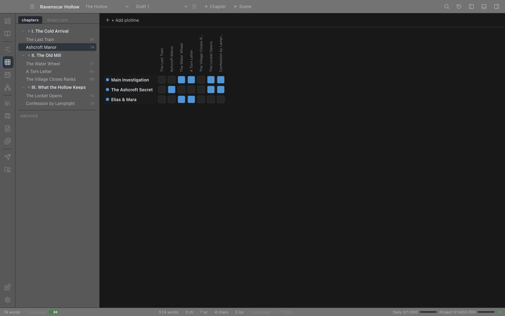

# Plot Grid & Plotlines

A **plotline** is a thread that runs through your story. The romance, the mystery, the political subplot, the protagonist's internal arc — each can be a plotline.

The **Plot Grid** is a spreadsheet-like view that shows every plotline as a row and every scene as a column. Cells mark which scenes belong to which plotline. Use it to see structure at a glance, spot threads that have been dropped, or check that subplots have setup and payoff.

## Opening the Plot Grid

Open it from:

- The **Plan** mode — click **Plot Grid**, under **Shape** in the mode panel.
- The command palette (`Ctrl+Shift+P` → "Plot Grid").
- The hotkey `Ctrl+8` (macOS uses Cmd; see [Hotkeys](26-hotkeys.md)).

The grid fills the main area.

## Anatomy of the grid

- **Rows** — one per plotline in the active book. Each row header shows the plotline's **color swatch** and **name**.
- **Columns** — one per scene, in story order. The column header shows the scene title; hover it to see the full `Chapter - Scene` label, and click it to open that scene in the editor.
- **Cells** — click a cell to toggle whether that scene belongs to that plotline. Assigned cells fill with the plotline's color. **Right-click an assigned cell** to attach a short **note** — what this scene actually does for that thread ("sets up the betrayal", "pays off the ring"). A cell with a note carries a small corner marker, and hovering it shows the note in the tooltip. Submit an empty note to clear it.

Because assigned cells take the plotline color, it is visually obvious which threads are dense and which are sparse.

## Managing plotlines

### Adding a plotline

Click **Add plotline** in the grid toolbar and enter a name. The plotline appears as a new row, taking the next colour in the palette so it is distinguishable from the threads already there.

### Renaming and deleting

Right-click the plotline's row header:

- **Rename**
- **Delete**

Deleting a plotline removes its row and clears the assignment from every scene that referenced it (a confirmation dialog asks first).

## Marking scenes

Click a cell at the intersection of a plotline and a scene to toggle that scene's membership. A scene can belong to any number of plotlines. Assignments are stored on the scene and travel with the project.

A tick alone tells you a scene touches a thread, but not *how*. Right-click an assigned cell to add a one-line note saying what it contributes — reading a row of notes left to right is the fastest way to check that a subplot has setup, escalation, and payoff rather than three scenes that merely mention it.

## Reading the grid

Once scenes are tagged:

- A row of mostly empty cells is a thread that has gone quiet — check whether that is intentional.
- A column with no marks is a scene that advances nothing you are tracking.
- Clusters of one color show where a subplot takes over; long gaps between marks show where it disappears.

## Threads as lanes

**As lanes** in the toolbar swaps the matrix for a track per thread, running left to right across the book in reading order.

The grid answers "is this thread in this scene", one cell at a time. What a revision asks is *where two threads meet* — the scene carrying the romance and the mystery at once is the scene doing structural work, and a matrix of four hundred cells hides it.

- A track runs from a thread's **first** scene to its **last**, so a gap in the middle reads as a gap rather than as the end of the thread.
- Every scene carrying **more than one** thread is marked down the full height. Those columns are what you came to find.
- Click a stop to open that scene.
- A thread in no scene yet says so rather than drawing an empty row.

Each thread takes its own colour when you create it, so the tracks stay apart.

## Setups and payoffs

Under the grid is a **Setups and payoffs** panel. A plotline says which scenes belong to a thread; a promise says something more specific — that a scene has told the reader to expect something.

Add one by picking the scene that sets it up and typing what it promises, in your own words: *the gun on the mantel*, *the letter she never opened*. Then, when you write the scene that answers it, pick that scene as the payoff.

Each promise is judged against where its payoff sits in reading order:

- **Unpaid** — nothing pays it off. This is the one worth being told about, so unanswered promises sort to the top.
- **Paid off** — the payoff comes after the setup. Nothing to do.
- **Out of order** — the payoff comes *before* the setup. Moving a scene is enough to cause this, which is exactly why it is reported instead of being counted as kept.
- **Payoff gone** — the scene that paid it off has been deleted.

Click a promise's scene name to open that scene. A scene cannot pay off its own promise; picking it does nothing, because nothing would have been answered.

## Tips

- **Have a thin plotline for everything.** Even the protagonist's internal arc benefits from being a row — you can spot stretches where you forgot to advance it.
- **Re-plot after a draft.** After finishing a draft, walk the grid scene by scene and tick what each scene actually did. The resulting grid is the truth of the manuscript, not your outline's prediction.

## Rows from the Codex

The drop-down at the head of the toolbar chooses what the rows are: **Plotlines** (the default), or **Characters**, **Locations**, **Items** or **Lore**. With a Codex row source the grid crosses your scenes with your Codex entries, and a ticked cell means *this entry is in this scene*.

That tick writes the scene's cast — the same record the [Wiki](30-wiki.md) reads for appearances, that [saved lists](16-smart-lists.md#who-is-in-the-scene) match on, and that the Timeline shows. Ticking a row of cells across the grid is the fastest way there is to say who is in which scene, and none of it depends on the name appearing in the prose.

Plotline rows keep their right-click menu for renaming and deleting; a Codex row does not, because an entry is renamed where it lives.

## A thread as more than a row of ticks

A plotline carries more than a name and a colour:

- **Importance** — **main**, **subplot** or **minor**. A grid of equal rows says a romance running through every chapter and a running joke are the same kind of thing. They are not, and the difference is what tells you whether a thread is under-served or simply small. Everything starts a subplot; promoting one nobody promoted is the worse mistake.
- **Cast** — the Codex entries the thread belongs to. A membership grid can say which scenes a thread touches and never whose story it is.
- **Steps** — what has to happen for the thread to be finished, in order, each one tickable and each one optionally pointing at the scene where it lands. Membership answers "is this thread in this scene"; it cannot answer whether the thread ever resolves, which is the commonest developmental note there is. The count of unresolved steps is what you read down the list for.

No steps means nothing was planned rather than everything being done, and the panel says which.

## Thread colours outside the grid

A plotline has carried a colour since the Plot Grid shipped and it never left this view, so which threads a scene serves was invisible everywhere you actually write.

Scenes in the binder now show a small dot per thread, in the book's plotline order — so the fact that this scene and that one are the same thread is visible without opening the grid. Capped at four dots: past that they stop being distinguishable and start being a smear.

## Where to go next

- [Chapters & Scenes](04-chapters-and-scenes.md) — scenes hold the plotline assignments.
- [Manuscript view](10-manuscript.md) — read the book continuously, filtered by chapter status.
- [Timeline](12-timeline.md) — the chronological view of the same story.

## Earlier versions of a thread

Open a thread's detail dialog and **Earlier versions** lists what it said before each of its last few saves, with a **Restore** beside each. Typing over a thread's description, or replacing its steps, used to have no answer inside the app.

Restoring keeps the current state as a version of its own, so an unwanted restore is undone the same way. The last 25 are kept per thread, beside the scene snapshots.
