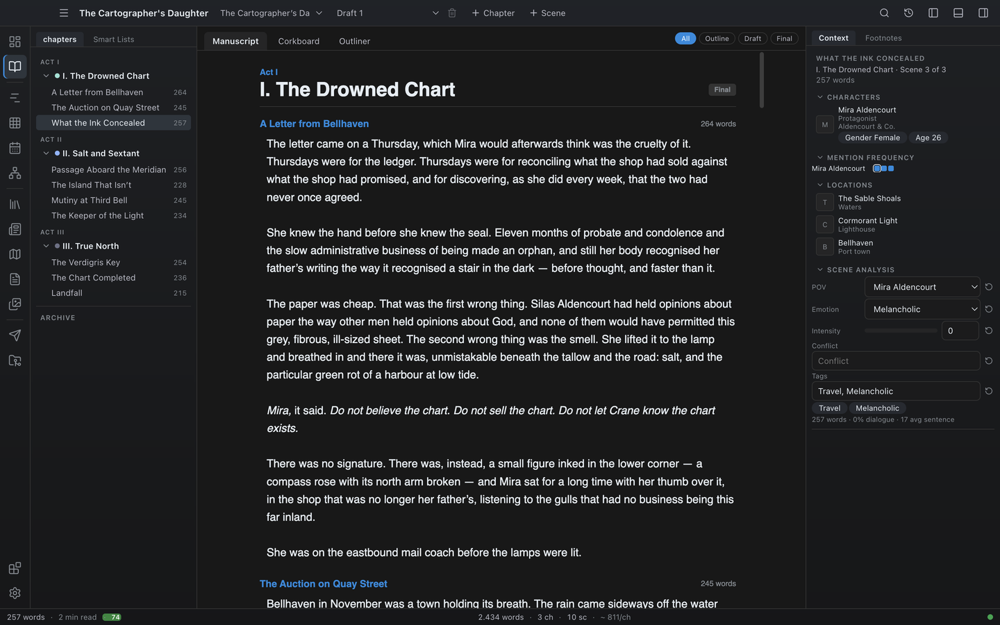

# Manuscript view

The Manuscript view stitches every scene of your book into a single continuous document. It is the closest you get to reading the manuscript the way a reader would — without exporting.

It has three display modes: **Manuscript**, **Corkboard**, and **Outliner**.

## Opening the Manuscript view

Open it from the **Write** group in the activity bar (**Manuscript**), from the **Go** menu or command palette, or with `Ctrl+5` (macOS uses Cmd).

## The toolbar

A mode switch at the top-left toggles between **Manuscript**, **Corkboard**, and **Outliner**. The choice is kept while the app is running.

At the top-right, a status filter limits which chapters are included in all three modes:

- **All** — every chapter (default).
- **Outline** — only chapters at Outline status.
- **Draft** — only chapters at First Draft status.
- **Final** — only chapters at Final status.

Chapters at Revised or Edited status appear under **All**.

## Manuscript mode

The default mode. All chapters and scenes render top-to-bottom as one scrollable document:

- **Act headers** appear above the first chapter of each act.
- **Chapter headings** show the chapter title and a **status badge** — click the badge to cycle the chapter's status (Outline → First Draft → Revised → Edited → Final).
- Each scene has a small header with its **title** and a live **word count**. Click the scene title to open that scene in the Editor view.
- The scene prose itself is **editable in place**. Type directly into the manuscript; changes save automatically after a short pause, exactly like the editor.

A footer at the end of the document totals what is currently visible (respecting the status filter): word count, scene count, and estimated reading time.

Use this mode for read-throughs and light line edits without leaving the flow of the book.

## Corkboard mode

Each scene becomes a card on a board, grouped under its chapter title. Each card shows:

- **Scene title**.
- **Synopsis** — editable directly on the card; the change is saved when you click away.
- **Word count**.

Corkboard mode is ideal for planning passes: skim the whole book as synopses and fill in the summaries you skipped while drafting.

## Outliner mode

A table with one row per scene and these columns:

- **Chapter**
- **Scene**
- **Synopsis** — editable inline; saved when you leave the field.
- **POV** — editable inline; saved when you leave the field.
- **Words**

The outliner is useful for:

- Bulk editing synopses.
- Auditing and correcting POV assignments (Smart Lists filter on this field).
- Eyeballing word counts to find unusually short or long scenes.

## The Target column

The outliner's last column is each scene's [word target](04-chapters-and-scenes.md#word-targets). Type a number to set one, clear the field for none. This is the fastest place to set targets across a run of scenes, since you can tab straight down the column.

## Selecting several scenes

Corkboard cards and outliner rows carry the same multi-select as the binder: ctrl-click (Cmd-click) a scene title to add it to the selection, shift-click to extend the range, and a bulk bar appears at the bottom once two or more are selected. The selection is shared with the binder and the Calendar. See [Chapters and scenes](04-chapters-and-scenes.md#selecting-several-scenes-at-once).

## Where to go next

- [Editor](05-editor.md) — for actually writing the scenes.
- [Smart Lists](16-smart-lists.md) — saved scene queries over status, POV, and tags.
- [Export](20-export.md) — when you want a file outside the app.
