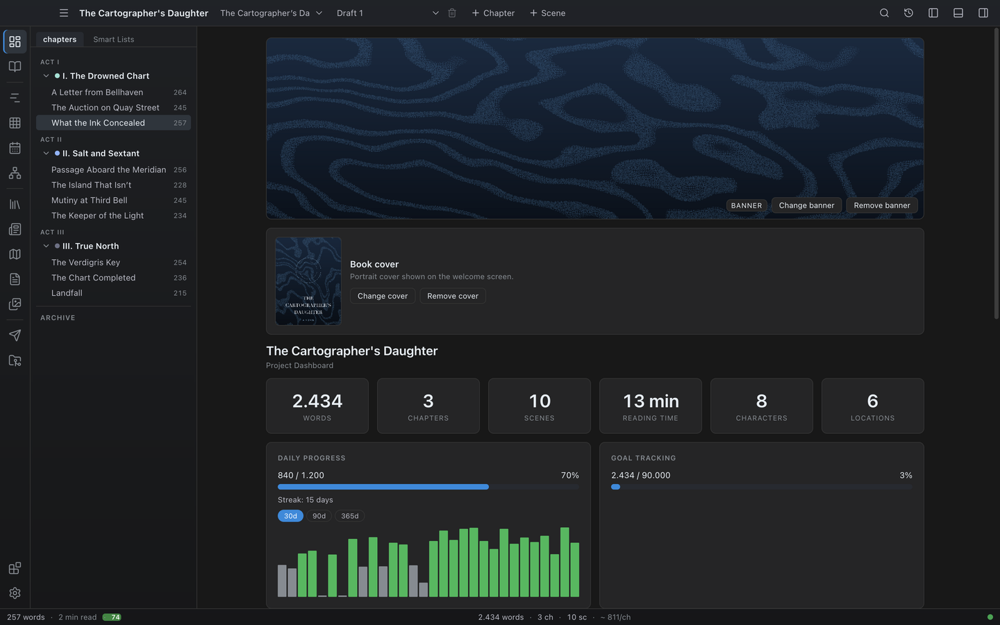

# Dashboard

The Dashboard is your project's numbers page. It shows totals, goals, streaks, status breakdown, pacing, and writing-quality cues — the numbers you want to glance at before sitting down to write, and the ones you want to check before declaring a draft done.

## Opening the Dashboard

Open it from the **Write** group in the activity bar (**Dashboard**), from the **Go** menu or command palette, or with `Ctrl+2` (macOS uses Cmd).

## What the Dashboard shows

### Banner and book cover

Novalist keeps two distinct images for a project:

- The **banner** — a wide image shown across the top of the Dashboard. Use **Add banner** / **Change banner** / **Remove banner** in the banner's action row. When no banner is set, the Dashboard falls back to the book cover so projects made before this split keep showing their existing image.
- The **book cover** — a portrait image shown for the project on the welcome/start screen and in the recent-projects list. Set it in the **Book cover** panel just below the banner with **Add cover** / **Change cover** / **Remove cover**.

Both images are stored with the project. Setting only a cover on a fresh project also gives you a Dashboard banner automatically (via the fallback); set a banner explicitly when you want a different wide image from the portrait cover.

### Header and top-line stats

The project name heads the page, with the **author** underneath (when set) and a **Project Dashboard** subtitle, followed by a row of metric cards:

- **Words** — total words in the book.
- **Chapters** — total count.
- **Scenes** — total count.
- **Reading time** — estimated minutes.
- **Characters** — number of Character entities.
- **Locations** — number of Location entities.

### Daily Progress

**Click the card title to edit your daily word goal.** The card shows:

- Words written today against the daily target, with a progress bar and percentage.
- Your current **streak** — consecutive days on which you wrote.
- A **history chart** of words per day. Buttons switch the range between **30d**, **90d**, and **365d**; bars on days where you met the goal are highlighted, and hovering a bar shows the date and word count.

### Writing history

Under the daily bars, four figures the per-day journal can answer that a streak cannot:

- **Longest streak** — the best run of days you met the goal.
- **Days goal met** — what share of your writing days hit it.
- **Best day** — your highest single day, with its date.
- **Average per writing day** — across the days you actually wrote.

### Weekly and monthly goals

Set a **weekly** or **monthly word goal** in Settings and it appears under the daily bar with its own progress bar. Both are off until you set one — nobody is handed a budget they did not ask for.

A daily goal asks the same of every day, which is the wrong question if you write a few heavy days rather than a little every day: you miss four days in seven while being exactly on schedule, and a bad Tuesday can never be made up on Saturday. The week is the budget most writers can actually keep.

Under a horizon you are behind on, Novalist says what it would take: the words left divided by the **writing days** left in that week or month, today included. So "behind" reads as "behind, with three days to fix it".

### Writing days and an adaptive goal

Tick the weekdays you write on. Days you untick are left out of every figure above and never break a streak — a streak that snaps on a Sunday you told Novalist you take off is not measuring anything.

**Recalculate today's goal from what is left** replaces the flat daily goal with what is actually needed: the words remaining to your project goal, spread over the writing days between today and your deadline. It falls back to the flat number when there is no deadline to plan against, and past the deadline it asks for everything that is left, today, because that is the truth.

### Goal Tracking

**Click the card title to edit your project word goal.** The card shows:

- Total words against the project target, with a progress bar and percentage. This is the whole-book goal; targets on individual acts, chapters, and scenes live in their own card below.
- When a **deadline** is set (see below), a detail row with the **deadline** date, the **days left**, and the **words per day** you need to average to hit the target on time.

### Premise

The book in one line, then in one paragraph, then a summary per act - the Snowflake ladder, as project data rather than notes in a scene. Each box saves as you leave it.

The act boxes follow the acts your chapters are actually in, so a book in two acts or five is not asked to pretend it has three. Give a chapter an act and a box for it appears here.

You can fill this in at any time; Novalist also offers it when you create a project (see [Projects and books](03-projects-and-books.md#starting-from-a-premise)).

#### Written in

Two drop-downs under the act boxes: the **narrative person** and the **tense** the book as a whole is meant to be in. Both start at "not decided", and nothing happens until you choose.

Once you have, the [Inspector](22-context-sidebar.md) says when the open scene reads differently — a first-person scene in a third-person novel, a present-tense one in a past-tense book. Novalist has always detected a point of view per scene; what was missing was anything for that scene to be wrong against.

The declaration is yours, not derived. Reading it off whichever mode most scenes happen to be in would make the one that drifted look normal.

The check stays quiet where it cannot be sure: under about sixty words there is not enough prose to read, and a scene it cannot read counts as agreeing. Tense is read from verb forms your writing language marks, so it is checked for English and German and reported as unknown for Chinese, which marks tense with particles instead. A weak reading is phrased as a question rather than a verdict.

#### The pitch

What a query letter, a submission form and a retailer page ask for by name: **genre**, **readership**, **comparable titles**, **setting**, a **blurb** and a **synopsis**.

Blurb and synopsis are both here on purpose and make opposite decisions: a blurb withholds the ending to make somebody open the book, a synopsis gives it away because the person reading it is deciding whether to represent you.

All of it is stored with the book, so a comparable title stops being quoted from memory and a genre stops being described three different ways in three different submissions.

### Tension

A bar per scene, in reading order, as tall as that scene's intensity. Negative intensity is drawn in a different colour, and a scene nobody has rated yet is a hairline rather than a flat bar — because "calm" and "unrated" are not the same thing. Click a bar to open that scene.

Intensity is set per scene in the [context sidebar](22-context-sidebar.md); Novalist estimates it and you can override it. The chart appears once at least two scenes have been rated: a single point is not a curve.

This is where a long flat stretch, or a peak in the wrong place, is visible — the number on its own in the Inspector never said that.

### Your rating axes

The same chart, for a number of your own rather than one of ours.

Any scene field you defined as **Number** in [Settings → Your Own Fields](23-settings.md#your-own-fields) can be charted here: stakes, pace, how much the viewpoint character knows, how far a subplot has moved — whatever you decided is worth a number. Define more than one and a picker appears to switch between them.

The chart scales to the largest value you actually used, so an axis that runs 1 to 5 and one that runs 0 to 100 both fill the height. A scene where you left the field blank is a hairline, not a zero. Click a bar to open that scene.

The card only appears once you have at least one numeric scene field, and the chart once at least two scenes carry a value.

### Character arcs

One row per character who has an [arc](06-codex.md#arc-characters): their name, the two ends of the change, and their turning points in reading order. Turns bunched into one stretch of the book are worth a second look. A turn you have not placed in a scene yet sorts last and is drawn as an outline.

The card only appears once at least one character has an arc.

### Word targets

Every [word target](04-chapters-and-scenes.md#word-targets) you have set, in one place: a row per act, chapter, and scene with a progress bar and `written / target`. Click a row to change or clear that target.

Targets can also be set from here rather than only from the binder — pick a chapter or act from the drop-down at the bottom of the card and press **Set target**. The card is where to look when you want to know which parts of the book have a length in mind and how they are doing against it.

### Submissions

Novalist produces submission-ready material — the [Exposé](25-expose.md), the Shunn layout — and used to record nothing at all about where any of it went. So the one thing you must not do, send the same manuscript to the same agent twice, was the one thing it could not help with.

Type a recipient and press **Record a send**. Each row then takes what you sent, when, what came back, when they answered, and a note.

- **Submissions still out are listed first** and marked down the edge. Those are the ones you are waiting on, and ordering by date buries them under a year of rejections.
- **Dates are free text.** A half-remembered "March" is worth recording, and a date picker would demand a day you do not have.
- If the book is **already out** with the name you are typing, a reminder appears before you record it — with the dates it went. It is a reminder, not a refusal: querying the same agency twice on purpose, a different agent there or a re-query after a rewrite, is normal, and an app that blocks it is one you work around.
- A send that was **rejected is not a duplicate**. Sending again afterwards is a new attempt.
- Removing a row deletes the record, not the fact. Use it to fix a mistyped entry.

### Averages

A small card pairs **average words per chapter** with the project's **estimated reading time**.

### Progress Breakdown

One row per chapter status — Outline, Draft, Revised, Edited, Final — with a status dot, a bar showing that status's share of chapters, and the chapter count plus word count at that status. Below the rows, a summary strip shows the plain chapter **count at each status**.

## Scene stages

The same shape, one level down: a row per [scene stage](04-chapters-and-scenes.md#scene-stages) in your own colours, with the scene count and word count at each. Scenes you have not given a stage are listed as **No stage set** rather than folded into the first one, so the untriaged part of the book is visible instead of quietly counted as outlined.

This is the breakdown that reflects a revision in progress. The chapter statuses above move a chapter at a time; the stages move a scene at a time, which is how revision actually happens.

### Pacing Analysis

Opens with a summary of the **longest chapter**, the **shortest chapter**, and the **average scene** length. Below it, one row per chapter shows a bar with the chapter's word count relative to the book's longest chapter. Look for outliers — a chapter twice as long as its neighbors deserves a closer look.

### Echo Finder

Phrases that recur unusually often across the manuscript, with their frequency. Useful for spotting tics, repeated metaphors, and overused turns of phrase. Consider varying your language where counts are high.

### Recent Activity

A short list of the scenes you edited most recently, each with its chapter and a timestamp — a quick way to pick up where you left off. Click any row to open that scene in the editor.

## Configuring goals

Two places:

- **On the Dashboard** — click the **Daily Progress** or **Goal Tracking** card title and enter a number.
- **Settings → Writing Goals** — **Daily Word Goal**, **Weekly Word Goal**, **Monthly Word Goal**, **Project Word Goal**, and **Project Deadline** (`YYYY-MM-DD`). The deadline and the two longer horizons can only be set here.

Goals are per-project.

## Tips

- **Pick one number to track.** Most writers benefit from one daily goal and one project goal. Pick the number that actually moves you and ignore the rest.
- **Use status as truth.** A draft is not "done" until every chapter is at least at First Draft; revision is not done until everything is at Revised. The Progress Breakdown is a useful forcing function.
- **Watch the echo phrases.** A unique stylistic flourish becomes a tic on the third repetition. The Echo Finder is the cheap version of a copy-edit pass.

## Writing sprints

The Dashboard counts days. A **sprint** counts a sitting, which is the only figure that means anything while you are still in the chair.

The status bar's timer starts one. Pick how long — 10, 15, 25, 45, 60 minutes, or no limit — and the status bar shows the time left and the words you have added since you started, live. Pause and resume without losing the clock; **Finish** records it.

Words are counted against the whole project as it was when the sprint began, so words added anywhere count and a deletion pass reads as zero rather than as going backwards. The pace is only shown once a sprint has run half a minute: below that the number says more about the arithmetic than about the writing.

Finished sprints are kept with the project — the last two hundred of them — with a running total and an average pace weighted by time, so a two-minute sprint does not count as much as an hour. The list and the totals are in the sprint panel, along with a way to clear them.

## Across the whole book

Everything above counts words. This section counts *where things are*, which Novalist could compute per scene but only ever showed one scene at a time — so "which character is this book actually about" had no answer anywhere.

- **Point of view across the book** — how many scenes each POV character carries, and what share of the book that is. The share is by scene count rather than words, because that is what the question means: one very long scene should not read as dominance. Scenes with no POV set are listed too, since how much of the book that is worth knowing.
- **Scenes per act** — the same, grouped by act.
- **Where each character appears** and **Where each location appears** — one strip per entity with a cell per chapter, darker where they appear more. A gap in the middle of a strip is a character who leaves the book for six chapters, which is very hard to see any other way.
- **In the Codex, never in the manuscript** — entries nothing mentions. Either they are still to come, or they were planned and quietly dropped; this is the only place that difference becomes visible.

Presence is counted from confirmed [@-mentions](05-editor.md#entity-mentions-and-autocomplete), by entity id rather than by name — so two characters sharing a first name are never confused for one another.

## Where to go next

- [Settings](23-settings.md) — set goals and the project deadline.
- [Manuscript view](10-manuscript.md) — read the book filtered by status.
- [Chapters & Scenes](04-chapters-and-scenes.md) — where chapter statuses are set.
