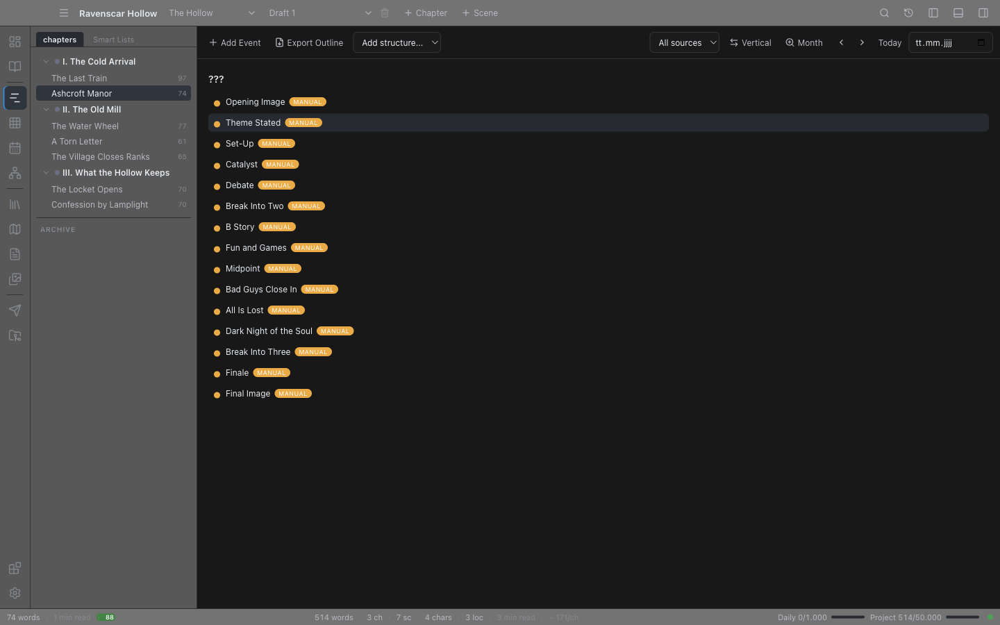

# Timeline

The Timeline is a chronological view of your story. It collects everything that has a date attached — acts, chapters, scenes, and manually added events — and groups them along a time axis you can zoom in and out of.

Use it to see the pacing of in-world time, to spot timeline holes, and to plan beats that are not tied to any particular scene.

## Opening the Timeline

Open it from the **Plan** mode (**Timeline**, first under **Shape** in the mode panel), from the **Go** menu or command palette, or with `Ctrl+3` (macOS uses Cmd).

## What appears on the timeline

- **Acts** — each act name appears once, ahead of its first chapter.
- **Chapters** — every chapter that has a date.
- **Scenes** — every scene that has a date (a scene without its own date inherits its chapter's date). Shown as `Chapter: Scene`.
- **Manual events** — anything you add directly to the timeline.

Each entry shows a marker dot, its title, a **source pill** naming where it came from (Act, Chapter, Scene, or Events), its date, and (for scenes and manual events) a description or synopsis. Events that reference characters or locations also show them as **chips** under the description. A chip whose name matches exactly one Codex entity is a link — click it to open that entity's article in the [Wiki](30-wiki.md). Names that match more than one entity, or none, stay plain text.

Entries are grouped under headers according to the zoom level (for example `2024`, `Mar 2024`, or `Mar 15, 2024`). Undated entries collect in a `???` group at the end — handy as an inbox of beats still waiting for a date.

**Dates** are free-form text but sort best in ISO form: `YYYY-MM-DD` (also accepted: `YYYY-MM`, `YYYY`, `D.M.YYYY`).

## The toolbar

- **Add Event** — create a manual event (see below).
- **Export Outline** — pick a file and Novalist writes the timeline as a Markdown outline.
- **Add structure...** — story-structure templates (see below).
- **Character filter** — only show events that reference a specific character. The dropdown appears once at least one event references characters.
- **Location filter** — same, for locations.
- **Source filter** — limit to **Acts**, **Chapters**, **Scenes**, or **Events** (manual). Use this to hide the chapter rows when you only want your planned beats.
- **Timelines** — which timeline you are looking at (see below). Appears once the project has more than one.
- **Vertical / Horizontal** — toggles the layout direction. Vertical flows top-to-bottom for scrolling; horizontal lays groups left-to-right for a sense of pace.
- **Zoom** — cycles the grouping granularity: **Year → Month → Day**.

Filters combine. The layout direction and zoom level are saved with the project.

### Date navigation

To the right of the toolbar are controls for moving the visible window along the time axis:

- **Previous / Next** — step the scroll position back or forward by one unit of the current zoom (a year, month, or day) and highlight the group you land on.
- **Today** — jump to the group nearest today's date.
- **Jump to date** — pick any date; the timeline scrolls to the matching group, or the nearest dated group when nothing sits in that exact bucket.

## More than one timeline

A project starts with one timeline and everything goes on it. That is fine until it isn't: a war three hundred years before chapter one ends up sitting between two scenes of a Tuesday, and the shape of the book disappears under the backstory.

**Add timeline** in the toolbar makes a second one. Once there is more than one, a dropdown appears offering **All timelines** and each timeline by name.

- Events you add while looking at one timeline are put on it, and the event editor shows that. Otherwise they would vanish the moment you saved them.
- The event editor has a **Timelines** row of ticks. An event can be on **more than one** timeline — a duel belongs to a character's life and to the world's history at once, and keeping two copies in step is a job nobody wants.
- Events that name no timeline are on the first one. Everything you wrote before the project had a second timeline is therefore exactly where it was.
- Acts, chapters and scenes belong to the **first** timeline. They are the manuscript's own chronology, not something you filed anywhere, so a backstory timeline shows only what you put on it — otherwise the war is back among the Tuesdays and nothing has been separated. **All timelines** and the first timeline both show them.
- **Rename** and **Remove** appear beside the dropdown while you are looking at a timeline other than the first.
- Removing a timeline does **not** remove its events. They move back to the first timeline. The first timeline cannot be removed, because it is where everything unassigned lives.

## Reading order

The timeline sorts by date, which is right for a chronology and wrong for the question "what does the reader meet next" — a flashback dated 1999 is still the second scene of the book.

The **By date / In reading order** button switches between them. In reading order the timeline becomes one flat run in manuscript order, each row showing `R:n` (where the reader meets it), the date it happens on, and its [narrative mode](04-chapters-and-scenes.md#how-a-scene-sits-in-time) if it has one. Click a row to open that scene.

## Lanes

The character and location drop-downs *filter* the timeline down to one thread. That is the wrong tool for the question "does this POV disappear for eighty pages?" — filtering hides the very threads you are comparing.

The **Lanes** drop-down splits the timeline instead. Pick **character**, **location**, **POV** or **plotline** and you get one row per value, each holding that thread's events in reading order, so gaps and overlaps are visible at a glance.

- An event belonging to several values appears in every lane it belongs to. A scene shared by two POV characters is a scene where the threads meet, and showing it once would hide that.
- The last lane is always **Ungrouped** — the events with no value for whatever you split by. It is never hidden, because a lane view that quietly drops them reads as though the whole book is accounted for.
- Character and location lanes use the scene's [assigned cast](04-chapters-and-scenes.md#who-and-what-is-in-a-scene) and the people and places on manual events.

Set **No lanes** to go back to the dated view.

## Story-structure templates

The **Add structure...** dropdown appends a bundled set of beats to the timeline as manual events:

- **Three-Act** — Setup, Confrontation, Resolution; 8 beats.
- **Save the Cat** — Blake Snyder's 15-beat structure.
- **Hero's Journey** — the 12-stage monomyth.
- **7-Point Story** — Dan Wells' 7-point structure.

The beats arrive undated (they land in the `???` group). Work through them: open each beat, give it a date, link it to the chapter that delivers it, and replace the stock description with your own. Applying a template never touches your chapters or scenes — it only adds manual events, which you can edit or delete individually.

## Manual events

Click **Add Event** (or click an existing manual event) to open the event editor:

- **Name** — short label.
- **Date** — optional, e.g. `1043-03-01`.
- **Ends** — optional. Give one and the event becomes a span rather than a moment; see [Spans](#spans) below.
- **Who was there** and **Where** — names separated by commas. Novalist has always stored these on an event and only scene analysis ever filled them in, so backstory that never appears in a scene could not be attached to the people it defines. Names that resolve to exactly one Codex entry become links.
- **Category** — Plot Point, Character Event, Location Event, World Event, or **Other**.
- **Link to Chapter** — optional; associates the event with a chapter. When set, the event shows an **Open Chapter** button that jumps to that chapter's first scene in the Editor.
- **Description** — optional long text.

**Save** stores the event with the project. When editing, the dialog also offers **Delete**; alternatively, right-click a manual event on the timeline to delete it.

## Dates that follow other dates

Every date used to stand on its own. Move a siege by a week and you had to find and retype every date that hung off it — and the ones you missed did not announce themselves. They quietly said the wrong thing until somebody read the book and noticed the funeral happening before the death.

In the event editor, **Follows this event** hangs an event's date off another one:

- **Days after** is the gap. Negative puts the event *before* its anchor.
- **Counted from** picks the anchor's **start** or its **end**. "The week after the siege" means its end when the siege lasts a month.
- Moving the anchor moves everything downstream of it, through as many links as you have made.
- A span keeps its own length. A three-week siege that moves is still three weeks long.

**Pin this date** holds an event still. A cascade will not move it, but anything hanging off *it* still follows. Use it for the one date in a chain you are certain of.

Two things Novalist refuses rather than guesses at:

- **A loop.** Two events each waiting on the other have no right answer, so both keep the dates they have.
- **A date it cannot read.** An in-world calendar date is not a mistake to be corrected, so an event anchored to one is left alone.

Deleting an event does not disturb the dates that hung off it. They keep what they have and simply stop following anything.

## Spans

An event with an end, and a scene with a [date range](04-chapters-and-scenes.md), draw a bar under their date showing how much of the story they cover.

Every bar is measured against the whole book, not against the group it sits in, because two bars only mean something next to each other if they share a scale. A war spanning ten chapters and a pregnancy spanning twenty are now comparable at a glance, and where they overlap is visible — which a duration printed as "3 weeks" beside a marker dot could never show.

A span too short to see keeps a sliver of width. An invisible bar reads as no bar at all, which is a different statement.

## Editing other entries

Act, chapter, and scene entries cannot be edited from the timeline — change their dates on the item itself. Clicking a scene entry opens that scene in the Editor; clicking a chapter entry opens the chapter's first scene.

## Tips

- **Set chapter dates first.** Even a coarse date per chapter is enough to make the timeline meaningful; scenes inherit it automatically.
- **Use a template as a checklist, not a mold.** Apply Save the Cat, then delete the beats your story genuinely does not have — the ones left undated at the end are your gaps.
- **Filter by character to spot off-screen time.** A character filter shows where someone was "on screen" and where they were not — an easy way to catch a character who disappears for half the book.

## Structure

**Structure** in the toolbar opens a panel listing every beat of the story structure your book is written against, and — the part a checklist cannot do — where the manuscript actually puts each one.

Pick a structure from the drop-down: Three-Act, Save the Cat, Hero's Journey or 7-Point. Every beat then appears with the point in the book it belongs at, and a picker for the scene that fulfils it.

- A beat with no scene is shown greyed — that is a hole in the structure, and it is the thing worth noticing.
- A beat with a scene reports where that scene lands, measured in **words** rather than scene count. "The midpoint" means halfway through the reading; a book of three long scenes and twenty short ones does not turn over at scene eleven.
- When a scene sits more than a few points off where the structure expects, the panel says so: *"Lands at 90%, which is later than the structure expects."* Structures are not precise instruments, so a small drift is reported as on target rather than flagged.

A beat can only be claimed by one scene — binding a second releases the first, because two scenes cannot both be the midpoint.

**Create placeholder scenes** makes one empty scene per unfilled beat, each already bound to its beat and carrying the beat's description as its synopsis. They go at the end of the last chapter rather than being scattered at their target positions: guessing where a beat belongs among your existing scenes would reorder a manuscript you did not ask to have reordered.

Applying a structure from the toolbar's other drop-down still adds timeline events, which is separate — those mark the structure on the timeline, while this binds it to the manuscript.

### Writing your own structure

Novalist ships four structures. If you write to a method it has not heard of, the panel's toolbar lets you add your own:

- **+** starts a new structure: a name, a description, and a list of beats. Each beat has a title and the point in the book it belongs at, as a percentage — that percentage is what makes a structure more than a checklist.
- **Pencil** edits the structure currently chosen. Editing one of the four built-ins saves your version under the same name, which is how you adjust a shipped method instead of being stuck with it; deleting your version brings the original back.
- **Export** writes the structure to a `.json` file you can send to somebody else.
- **Import** reads one back. A structure whose name clashes with one you already have is imported as a separate copy rather than replacing it.
- **Trash** deletes a structure you authored. A book written against it stops pointing at something that no longer exists.

Structures you author are stored with the project, so every book in it can use them.

## Where to go next

- [Calendar](13-calendar.md) — the day/week/month calendar view of the same dates.
- [Chapters & Scenes](04-chapters-and-scenes.md) — chapters and scenes carry the dates.
- [Plot Grid](08-plot-grid.md) — the orthogonal view (plotlines × scenes).
