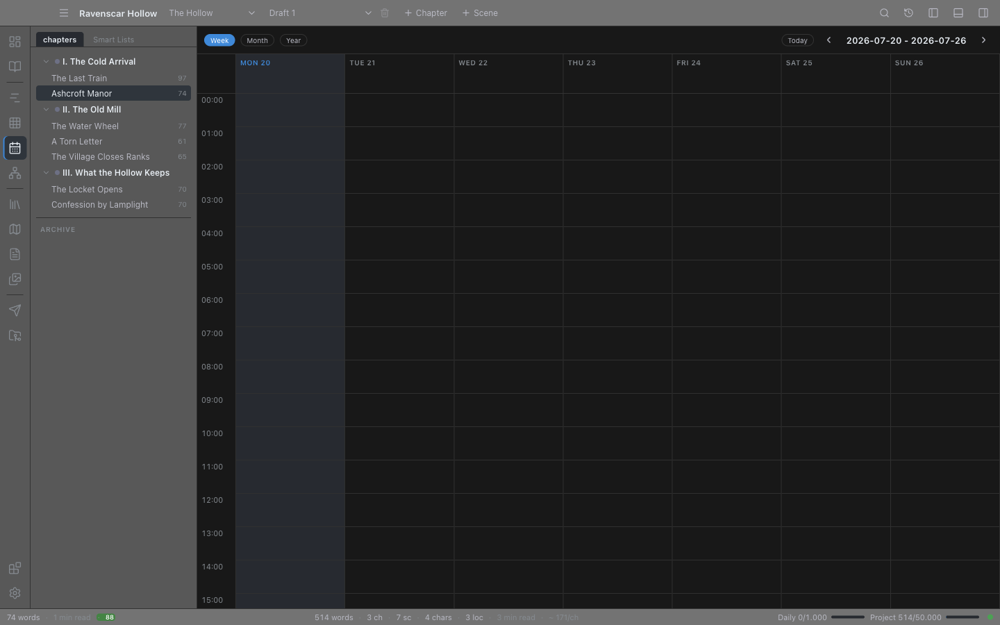

# Calendar & story dates

The Calendar lays your scenes out on a Gregorian calendar, using the story dates stored on scenes and chapters. Use it to see the in-world schedule of the book — what happens on which day, and at what time.

## Where the dates come from

A scene appears on the calendar when it has a resolvable story date: its own date (or date range), or, failing that, the date of its chapter or act. Dates can carry optional start/end times for hour-level precision; a scene without a time counts as all-day. A scene whose range spans several days appears on every day it covers.

Scene and chapter dates are part of the project data and are shared with the [Timeline](12-timeline.md).

## Opening the Calendar

Open it from the **Plan** group in the activity bar (**Calendar**), from the **Go** menu or command palette, or with `Ctrl+6` (macOS uses Cmd).

## View modes

Buttons at the top-left switch between three modes:

### Week

Seven day columns headed by weekday and date. Each day has two parts:

- An **all-day band** at the top, where all-day scenes sit as chips.
- A scrolling **24-hour timed grid** below it, with an hour gutter down the side. Timed scenes are placed by time of day and sized to their duration, with their start time (`09:30`) prefixed to the title. When several scenes overlap in time, they split into **side-by-side columns** so every one stays visible — the fast way to spot clashes where two scenes claim the same hours.

Hover a timed event or chip for the scene title, note, and synopsis; click it to open the scene in the Editor. Today's column is highlighted.

Use this view for schedule-driven sequences — a heist hour by hour, a wedding day, a multi-day siege.

### Month

A month grid under a **weekday header** row. Each day cell shows up to three scene chips; if there are more, a `+N` marker shows the overflow. Days outside the current month are dimmed, and today is highlighted. **Click a day** to jump straight to that day's Week view.

Use this view for the in-world pace of a chapter — and for finding empty days that need filling, or proving your protagonist is over-scheduled.

### Year

Twelve month cards. Each card lists the **scenes** that fall in that month (deduplicated so a multi-day scene appears once) with a scene count in its header. Click a scene to open it, or click the month header to jump into that month's Month view.

Use this view for macro-scale pacing and seasonal gaps.

## Scene notes

A scene's **note** shows on its calendar chip and timed event alongside the title, and in the hover tooltip together with the synopsis — a place for a short scheduling reminder that is not part of the prose.

## Rescheduling by drag and drop

In Week and Month view, **drag a scene chip onto another day** to reschedule it — the scene's story date is set to that day. This is the quickest way to shuffle the in-world schedule without editing dates by hand.

## Navigation and the anchor date

A **Today** button jumps back to the current date. The **Previous / Next** arrows step by one week, month, or year depending on the mode; the label between them shows the visible range. The date the calendar is centered on — the **anchor date** — is saved with the project, so the Calendar reopens where you left it.

## Tips

- **Even if dates don't matter, give chapters dates.** A coarse date per chapter puts every scene on the calendar; refine individual scenes only where the schedule matters.
- **For travel-heavy stories use the Week view.** Multi-day journeys plotted day by day quickly reveal whether the travel time is plausible.

## Where to go next

- [Timeline](12-timeline.md) — the other chronological view, including manual events.
- [Chapters & Scenes](04-chapters-and-scenes.md) — chapters and scenes carry the story dates.
- [Codex](06-codex.md) — character ages can be driven by birth dates.
