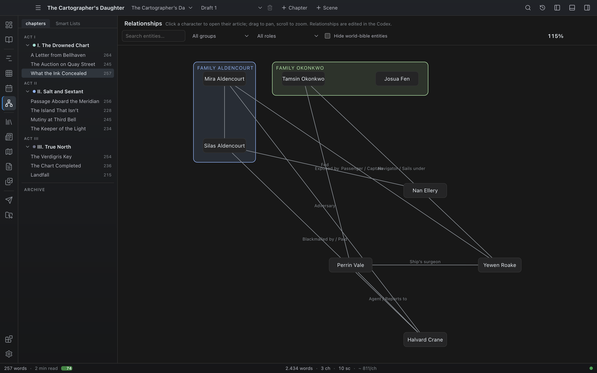

# Relationships graph

The Relationships view draws your characters as nodes and the relationships between them as labeled edges. It clusters families automatically, so big casts remain legible.

## Opening the Relationships view

Open it from the **Plan** mode (**Relationships**, first under **Cast and time** in the mode panel), from the **Go** menu or command palette, or with `Ctrl+7` (macOS uses Cmd).

## What you see

- **Nodes** — one per character that has at least one relationship. Characters with no relationships are hidden; if nothing is connected yet, the view tells you to add relationships in the Codex. **Click a node** to open that character's article in the [Wiki](30-wiki.md) (from there, **Edit in Codex** reaches the editable record). Dragging to pan does not trigger the click.
- **Edges** — lines between related characters, labeled with the relationship role (e.g. "Father", "Mentor", "Owes a debt to"). When two characters are linked by several roles, the labels combine into one edge ("Father / Mentor"). Family (parent/child) relationships instead render as unlabeled **genealogy T-connectors** — a vertical drop from the parents' mid-point branching out to each child — so a family tree reads at a glance without label clutter.
- **Family boxes** — related family members are enclosed in a soft box labeled `Family <surname>` (using the family's most common surname). Inside a box, generations are layered top to bottom: parents above children, partners on the same row.
- **Role-group boxes** — when three or more characters share the same non-family role (for example everyone tied to a "Ring"), their nodes are wrapped in a dashed box labeled with that role, grouping the shared connection visually.
- Characters connected only by non-family roles are arranged in a loose ring below the family clusters.

Each family and role box is drawn in its own colour so overlapping groups stay distinguishable.

## How family clustering works

Novalist detects family roles by keyword: relationship roles containing words like "father", "mother", "son", "daughter", "spouse", "wife", "husband", "partner", "brother", "sister", "twin" (and their equivalents in every bundled language) are treated as family links. The keyword vocabularies live in the locale files under the `relationships` section and are merged across all bundled languages, so role matching works regardless of the UI language you write in.

Other roles — mentor, enemy, business partner, owes a debt to — appear as labeled edges without clustering.

## Toolbar

- **Search** — type to filter the graph to characters whose name matches.
- **Filter by group** — show only characters in a chosen group. The dropdown lists the groups present in the cast.
- **Filter by role** — show only characters with a chosen role.
- **Hide world-bible entities** — hide characters marked as world-bible, leaving only this book's cast.
- **Clear filters** — appears once any filter (search, group, role, or hide-world-bible) is active; resets them all at once.
- **Centre on** — pick one entry and the graph shows only its neighbourhood. A whole Codex on one canvas proves the links exist and answers nothing; the question you actually have is what *this one* is connected to.
- **How far out** — one to four hops from whatever you centred on, shown once you have. Two is usually where a family or a faction becomes a visible shape. This is the graph's reach; the [family tree](#as-a-family-tree) has its own two generation limits instead.
- **Show scenes** — adds a node per scene with an edge to everything in it. Novalist always knew which entries appear in which scene and never drew that edge, so "where do these two actually meet" had no answer on the graph. Off by default: a node per scene doubles the canvas.
- **Zoom readout** — shows the current zoom percentage.

Filters combine. **Zoom** with the mouse wheel (20% to 400%); **pan** by dragging the background. Whenever the graph is rebuilt — on open, or after changing a filter — it **auto-fits** and centres itself in the viewport, so you never have to hunt for the cast.

**Clicking a node recentres the graph on it**, so following a thread never takes you out of the view — leaving it and coming back loses the shape you were reading. **Alt-click** opens the entry's [Wiki article](30-wiki.md) instead, or the scene itself for a scene node.

## Adding and editing relationships

The graph reflects what is stored on each character entity. To add a relationship, open the character in the [Codex](06-codex.md), go to its **Relationships** section, and add a role plus one or more target characters. When you add a relationship, Novalist offers to add the matching inverse on the target character so both sides stay in sync.

Return to the Relationships view and the graph updates.

## Tips

- **Name roles with family words when you want clustering.** "Father", "wife", "half-sister" cluster; "patriarch of" does not. Keep an eye on which edges end up inside boxes.
- **Use ALL CAPS for high-signal roles.** A directed "OWES MONEY TO" edge reads at a glance.
- **For very large casts, search.** Filtering to a name and its connections is more useful than zooming out over a hundred nodes.

## What the graph shows

**Show** in the toolbar picks which kinds of entry are on the graph: **Characters** (on by default, which is what this view has always been), **Locations**, **Items** and **Lore**. Turning them all on at once in a full Codex is unreadable, which is why it opens on characters alone — but "who holds this city" and "who has the sword" are the same question about a different kind of node, and now they can be asked.

Clicking a node opens that entry's own Wiki article, whatever kind it is.

## Kinds of tie

Each relationship in the Codex has a **kind of tie**: family, ally, rival, member of, owner of, place, or unspecified. The graph colours the line by it, so a marriage and a feud are told apart at a glance.

A tie with no kind draws in the neutral colour. Novalist used to guess "family" from keywords in the role text, which only ever worked in English — an unstated kind is now left unstated rather than guessed at. Setting the kind on the ties you care about is a minute's work and is the only thing that colours them.

## Telling the kinds apart

With more than one kind of entry on the canvas, each is drawn differently — by shape and by colour together, because shape alone stops working at a distance and colour alone stops working once the graph is dense:

- **People** — the rounded box the graph has always drawn.
- **Places** — square corners, green outline.
- **Things** — a pill, amber outline.
- **Knowledge** — softly rounded, in the accent colour.
- **Scenes** — a dashed outline and nearly square corners, so a scene never reads as a person.

A name too long for its box is cut short with an ellipsis; hover the node for the whole thing.

## How are these two related?

Centre the graph on somebody with **the whole world** picker, and every other node gains a line under its name saying what that person is to the one you centred on: *sibling*, *grandparent*, *great-aunt or uncle*, *second cousin once removed*.

None of that is written down anywhere. You record who somebody's parents are; that this makes them a great-aunt is arithmetic, and doing it by hand across a large cast is how family trees end up contradicting the prose.

- Only descent counts. Partners and in-laws are drawn as lines but are not kin, because there is no line of descent to measure along.
- Where two people share more than one ancestor, the nearest one wins — half-siblings who are also distant cousins read as siblings, which is what anybody in the room would call them.
- Widen **hops** if somebody you expect to see is missing: the label only appears on nodes the graph is currently showing.
- Parentage that loops back on itself — somebody recorded as their own grandparent, which a hand-edited file can say — is detected and stops rather than hanging.

Deciding that "Mutter" means a parent is a question about language, so it uses the same role words the family layout does, in every language Novalist ships. The answer itself is computed as a shape and then put into words, which is why it reads correctly whichever language the interface is in.

## Where to go next

- [Codex](06-codex.md) — where character relationships are edited.
- [Timeline](12-timeline.md) — track where those characters appear over story time.
- [Dialogue](33-dialogue.md) — every line one of those characters speaks, in story order.

## As a family tree

The canvas lays everything out by force, which is right for "what is connected to what" and wrong for "who descends from whom" — a force layout puts a grandmother wherever there is room, so three generations read as a cloud.

Centre on somebody, then **As tree**. The view redraws as generations on lines, with the person you centred on outlined.

- **Generations up** and **Generations down** are separate limits. Tracing a line of succession usually means many generations down and one or two up, and the same view with both at ten is unreadable.
- **Sideways / Downwards** turns the tree, for a family that is wider than it is deep.
- Click a box to recentre the tree on that person; hold Alt and click to open their entry.
- Hover for the whole name and what that person is to the root.

**How far out**, the graph's reach control, is not shown here. The tree is built from every entry in the project and reaches exactly as far as the two generation limits say.

### Who appears

The tree goes **up** from the person you centred on as far as *Generations up* allows, then comes back **down** from everyone it found, as far as *Generations down* allows. So it is the family rather than a line: setting one generation up brings in brothers and sisters, two brings in aunts, uncles and cousins, three brings in great-aunts and second cousins.

Going up follows only the line through the person you centred on. It does not climb into the family somebody married into, which would drag a second family's whole ancestry in behind it.

The tree is built from **parent** and **child** relationships. A row on an entry names what the *target* is to it — on Liam, "Mother -> Amy" means Amy is his mother.

**Brother**, **sister**, **sibling** and **twin** are read too, for the family you have not built out yet: naming somebody Liam's brother puts him on Liam's row even when no parents are recorded anywhere. There is no line to draw between them, because nothing has been said about who their parents are — record the parents and the tree draws the family properly.

