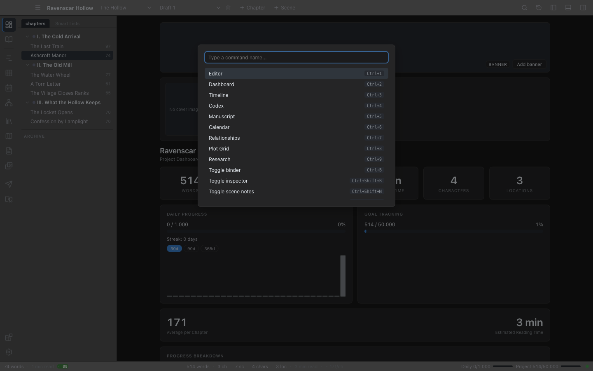

# Command Palette

The Command Palette is a single text box that can run **any** command Novalist has. If you don't remember where a view lives or what its hotkey is, you can usually get there faster by typing.

## Opening the palette

Press `Ctrl+Shift+P` (`Cmd+Shift+P` on macOS). The palette opens as an overlay in the center of the window.

## Using it

- Type any part of a command's name to filter the list. The command's internal id is matched too, so typing `nav` narrows to the view-switching commands.
- Use **Up / Down** to move the highlight, **Enter** to run the highlighted command, **Escape** to close.
- You can also click a command, or hover to highlight it.
- Each command shows **the gesture currently bound to it** on the right — the one you set in Settings, or the factory default. Most commands have none, and the column is simply empty for them.
- Clicking outside the palette closes it without running anything.

## What's in the palette

**Every command in the app.** The palette used to index only the two dozen actions that happened to carry a hotkey; it now lists the whole set, which is what makes it safe for a command to live in exactly one menu. That includes:

- **Every view**, by name — including the ones with no shortcut and no button of their own, such as Wiki, Maps, Languages, Planning board, Series, Style report, Extensions and Settings.
- **Every project command** — new chapter, new scene, new book, new draft, compare drafts, rename the project, clean up the manuscript, find and replace.
- **Every window command** — the panel toggles, the mode panel, focus mode, splitting and closing panes, pane layouts, workspace layouts, interface scale.
- **Every writing command** — paragraph styles, lists, alignment, bold and the rest of the inline marks, comment, footnote, snapshots, suggestion mode, read aloud and the writing options.
- **Commands from your extensions** — anything an installed extension registers, listed under its own name. The AI Assistant's critique passes, for instance, appear here once it is installed.

### Commands that cannot run are hidden

The palette only lists what can actually do something right now. With no text selected there is no **Comment**; with no scene open there are no **Scene snapshots**; with only one draft there is no **Compare drafts**; with no project open, only the commands that mean something without one. A line in the palette is never a line that fails when you click it.

That also means a command you are looking for and cannot find is usually a command that is waiting on something — select the passage, open the scene, and it appears.

Extension commands are read when the palette opens, so one that installs while Novalist is running shows up the next time you press `Ctrl+Shift+P` — no restart. They have no keyboard shortcut of their own unless the extension also binds one.

A command that takes required arguments is not listed, because the palette has no way to ask you for them. Those are for scripts and for the extension's own buttons.

## Tips

- **Use it instead of memorizing hotkeys.** Typing three letters of a view's name is often faster than recalling its number key.
- **Use it to find out where something lives.** Run it once from the palette, then look for it in the container its scope puts it in — see [Where things live](02-interface-overview.md#where-things-live).
- **Use it from Focus Mode.** With every panel hidden, the palette is the quickest way to switch views without leaving the keyboard.

## Where to go next

- [Quick Open](31-quick-open.md) — the content-finding counterpart: `Ctrl+P` searches scenes, Codex, notes, and research.
- [Hotkeys](26-hotkeys.md) — the default keybindings, and how to bind any of the rest.
- [Interface Overview](02-interface-overview.md) — the modes, panels and menus the palette navigates between.
